# 秒杀项目——笔记

------

## *1 基础搭建*


#### 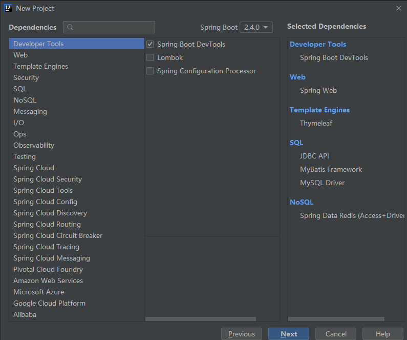

### 1.1 新建数据库

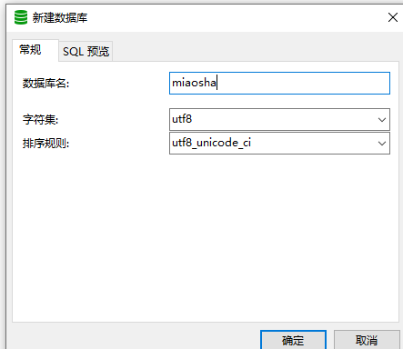

#### 1.1.1 user_info表

注意这个表里是没有密码字段的，因为密码一般会加密，所以密码跟用户的主表是需要分开存储的

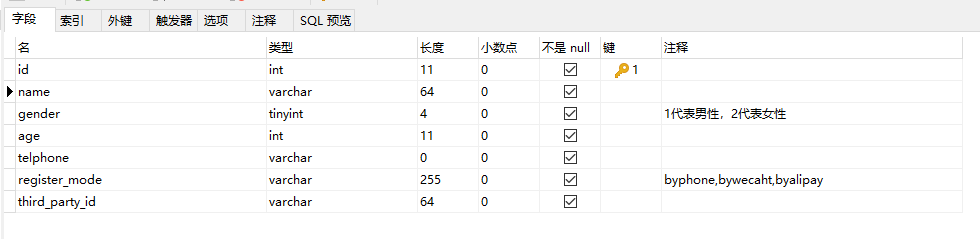

#### 1.1.2  user_password表

密码都是以密文存储在数据库中的,user_id对应user表的键

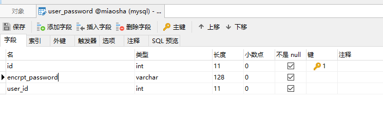

#### 1.1.3 order_info表

下单表的设计

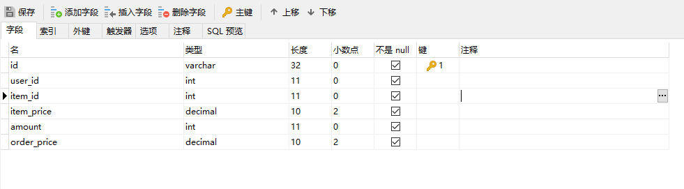


#### 1.1.4设置索引

手机号对应唯一账号，因此注册时不允许已经注册过的手机再次注册，需要在user_info表中添加手机号的唯一索引，如图所示：

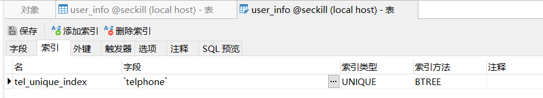

同时在ServiceImpl中，需要捕获由索引产生的异常

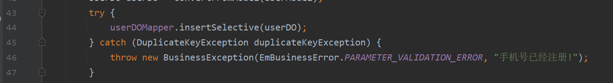


### 1.2 生成DO和Mapper

使用Mybatis_Generator自动生成DO,Dao,Mapper文件，需要注意的是，需要将IDEA中的sqldialects设置为none，否则*mapper.xml一些字段会报错

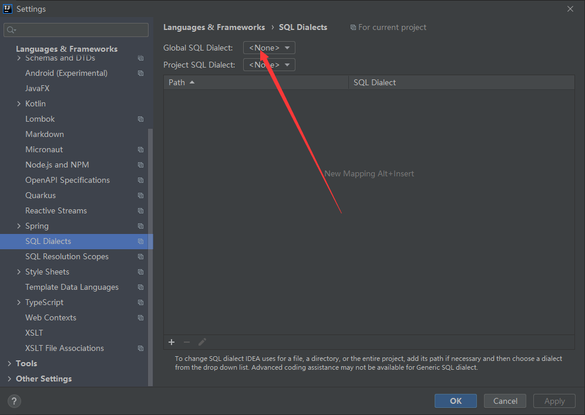

**非常需要注意的一点是，使用generator生成文件时，需要更改一下设置，否则生成的mapper.xml文件中，每一个方法，Map等都会生成多个，造成项目跑不起来，具体修改见下图。第一次做这个项目时我怎么没有遇到这个问题，同时将配置类中的自动覆盖打开，否则生成的dao和pojo也会出现两对，具体见图**

为什么要删除这项配置，见网页：[Mybatis Generator 生成代码重复 - muzi1994的个人空间 - OSCHINA - 中文开源技术交流社区](https://my.oschina.net/u/2289161/blog/1589644)

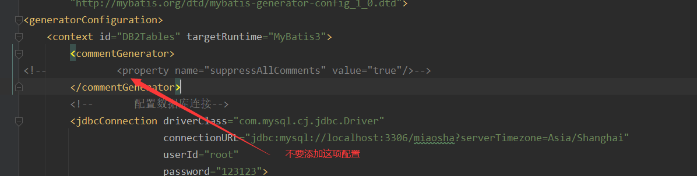

原因：

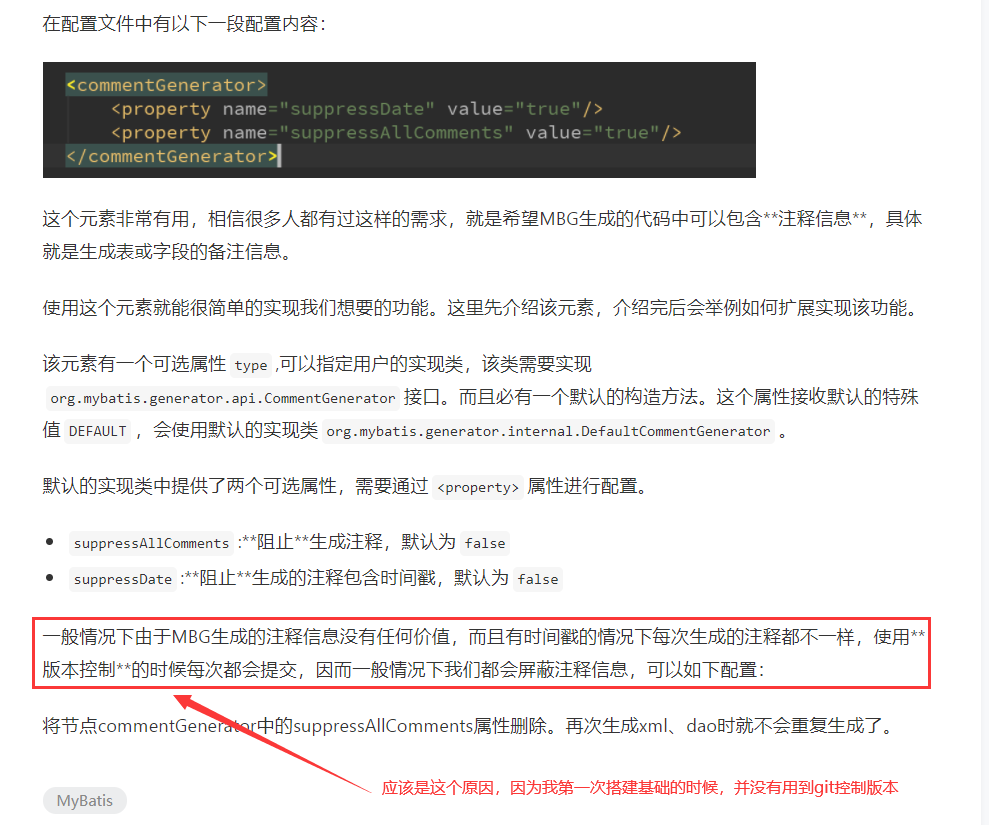

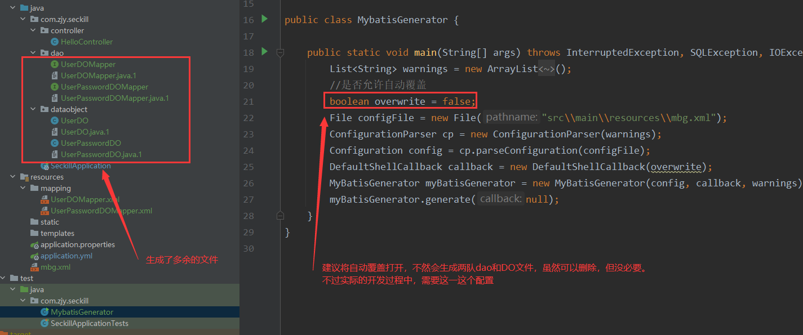

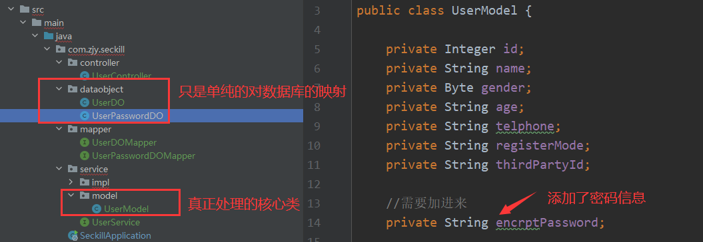

### 1.3 controller层对user类的映射

同样的，用于核心处理的类并不一定就是传给前端展示的类，比如我们肯定不能向前端传递密码等重要信息，因此在controller层，还需要再进行一次转化

**一般情况下，ViewObject的属性多于ModelObject多于DataObject**

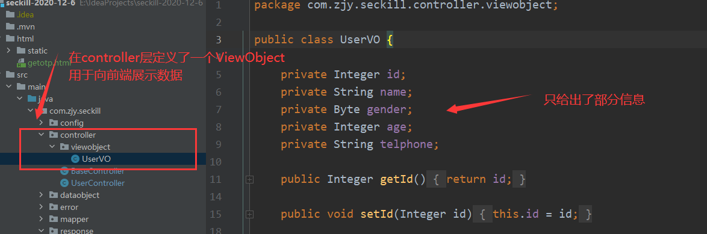

### 1.4 通用返回类型，异常处理

#### 1.4.1 异常的设置

这两个类的编写，理论上可以应用到其它很多项目上

先来看看通用返回类型`CommonReturnType.java`

```java
public class CommonReturnType {

    //表明返回结果的情况，success,fail
    private String status;
    //若success，则data返回前端需要的json数据
    //若fail，则data使用通用的错误码格式
    private Object data;

    //定义一个通用的创建方法，默认状态是success
    public static CommonReturnType create(Object data) {
        return CommonReturnType.create(data, "success");
    }

    public static CommonReturnType create(Object data, String status) {
        CommonReturnType commonReturnType = new CommonReturnType();
        commonReturnType.setData(data);
        commonReturnType.setStatus(status);
        return commonReturnType;
    }

    public String getStatus() {
        return status;
    }

    public void setStatus(String status) {
        this.status = status;
    }

    public Object getData() {
        return data;
    }

    public void setData(Object data) {
        this.data = data;
    }
}
```

异常类的通用方法接口，`CommonError.java`

```java
public interface CommonError {

    int getErrCode();
    String getErrMsg();
    CommonError setErrMsg(String errMsg);
}
```

具体的异常类，`BusinessException.java`

```java
public class BusinessException extends Exception implements CommonError{

    private CommonError commonError;

    //直接接收EmBusinessError用于构造业务异常
    public BusinessException(CommonError commonError) {
        //注意这里调用super()
        super();
        this.commonError = commonError;
    }

    //接受自定义errMsg的方式构造业务异常
    public BusinessException(CommonError commonError, String errMsg) {
        super();
        this.commonError = commonError;
        this.commonError.setErrMsg(errMsg);
    }

    @Override
    public int getErrCode() {
        return this.commonError.getErrCode();
    }

    @Override
    public String getErrMsg() {
        return this.commonError.getErrMsg();
    }

    @Override
    public CommonError setErrMsg(String errMsg) {
        this.setErrMsg(errMsg);
        return this;
    }
}
```

一个枚举类，用于定义项目中出现的异常，`EmBusinessError.java`

同时这里需要系统学习下枚举类的知识

```java
public enum EmBusinessError implements CommonError {

    //通用错误类型
    PARAMETER_VALIDATION_ERROR(10001, "参数不合法"),
    UNKNOWN_ERROR(10002, "未知错误"),

    //2000开头为用户信息相关错误
    USER_NOT_EXIST(20001, "用户不存在"),


    ;

    private int errCode;
    private String errMsg;

    EmBusinessError(int errCode, String errMsg) {
        this.errCode = errCode;
        this.errMsg = errMsg;
    }

    @Override
    public int getErrCode() {
        return this.errCode;
    }

    @Override
    public String getErrMsg() {
        return this.errMsg;
    }

    @Override
    public CommonError setErrMsg(String errMsg) {
        this.errMsg = errMsg;
        return this;
    }
}
```

#### 1.4.2 自定义异常的捕获

编写了一个BaseController，并且让其它的Controller继承这个Controller

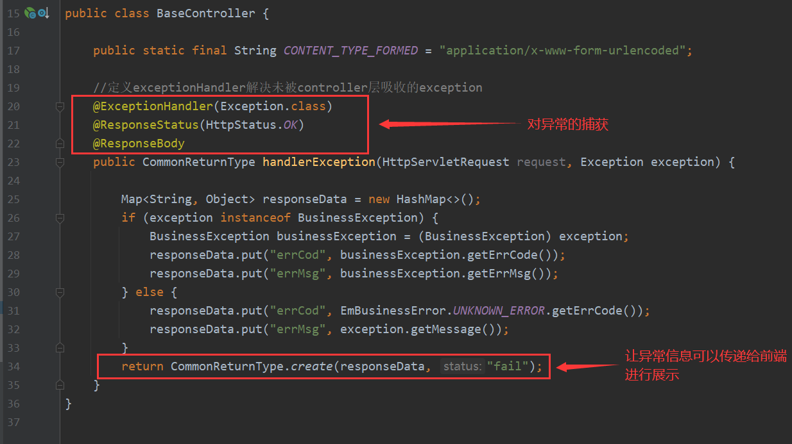

## *2 业务构建*

### 2.1 threadLocal的应用

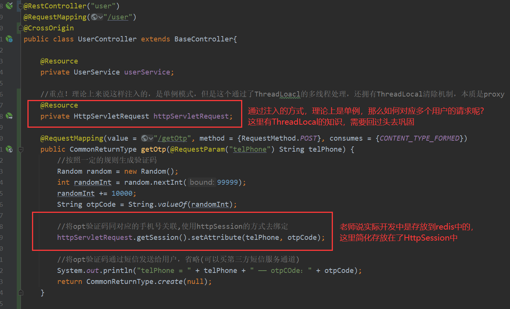

### 2.2 ajax小知识（contentType）

#### 2.2.1 from表单中添加false的重要性

如下图所示，在两处添加了return false的代码，第一次接触的时候没感觉到有什么用，但是当我用自己的前端页面时，出现了一个新的问题，见BUG 2.

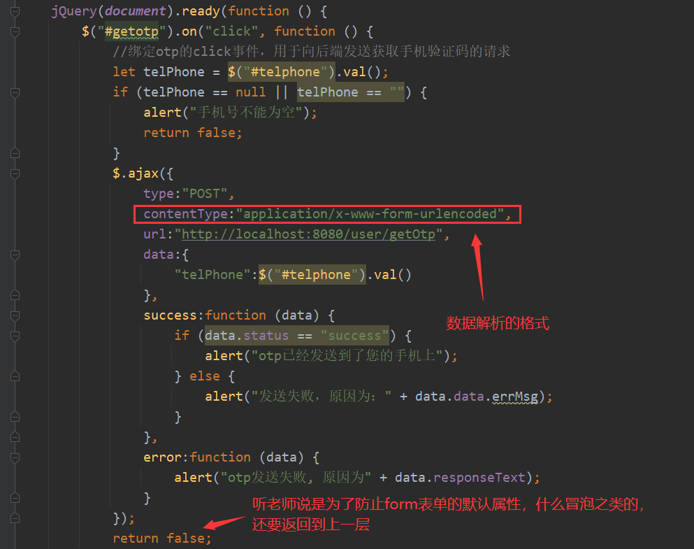

#### 2.2.2 contentType属性

如上图所示，在ajax请求中设置了contentType属性，意义如下：

将需要提交的数据发送出去后，还要服务端解析成功才有意义。一般服务端语言如 php、python 等，以及它们的 framework，都内置了自动解析常见数据格式的功能。服务端通常是根据请求头（headers）中的 Content-Type 字段来获知请求中的消息主体是用何种方式编码，再对主体进行解析。

这里设置的application/x-www-form-urlencoded是默认的数据格式。如果原生的form表单不设置该属性，就会以这种方式提交数据。

具体的讲解，见——[Ajax 请求头中常见content-type - itjeff - 博客园 (cnblogs.com)](https://www.cnblogs.com/itjeff/p/10240124.html)

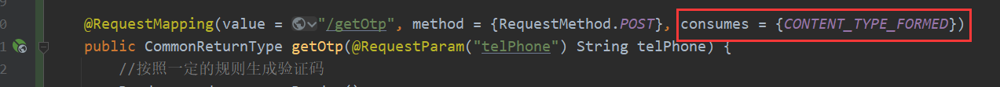

同理在Mapping中，也需要设置对应的contentType，用来设定处理什么格式的信息。

引用一张图片：感谢[RequestMapping中的参数consumes 与 produces_游湖虾_新浪博客 (sina.com.cn)](http://blog.sina.com.cn/s/blog_6472d0800102xjpm.html)

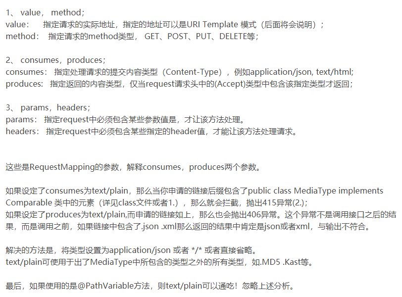

### 2.3 前端编写，引入样式

感觉自己做项目还是采用前后端分离的形式好一些，直接把html文件放入项目的主路径下，采用ajax和jquery传递数据。不然每次把前端和静态资源放入resources路径中，样式总是加载不出来。

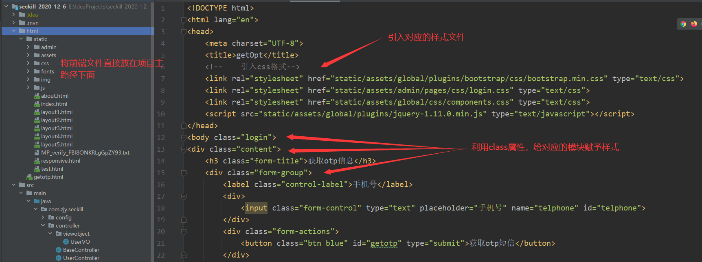

这样样式就能够出来了

### 2.4 解决跨域问题

将短信验证码存放在了session中，这里存在跨域问题，注意此时我的springboot版本是2.3.2.release

这篇博客对于同源策略讲解的比较清晰：[SpringBoot配置Cors解决跨域请求问题 - 袁老板 - 博客园 (cnblogs.com)](https://www.cnblogs.com/yuansc/p/9076604.html)

关于springboot2.4的解决方法：[springboot2.4.0跨域问题 - 技术交流 - SpringBoot中文社区](https://springboot.io/t/topic/2986)

原因等后面整理项目面试的时候再具体看看吧，先降到2.3.2.release版本。。。

解决方法：

1. 后端的Controller定义处

   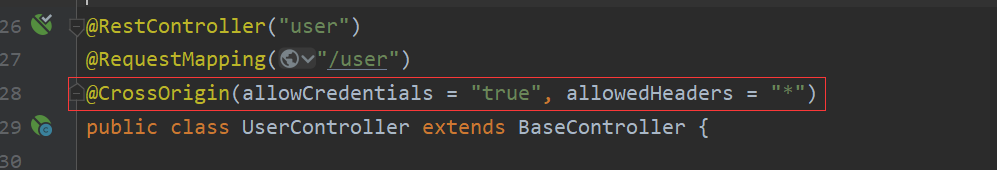

2. 前端

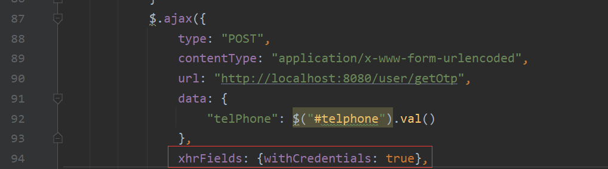

此处还有一个坑就是，当你的springboot版本升高时，比如我之前使用了2.4.0版本，运行项目会报错，当我换成2.3.2.release之后，就能成功运行起来了。。。

这是部分错误信息

```
org.springframework.beans.factory.BeanCreationException: Error creating bean with name 'requestMappingHandlerMapping' defined in class path resource [org/springframework/boot/autoconfigure/web/servlet/WebMvcAutoConfiguration$EnableWebMvcConfiguration.class]: Invocation of init method failed; nested exception is java.lang.IllegalArgumentException: When allowCredentials is true, allowedOrigins cannot contain the special value "*"since that cannot be set on the "Access-Control-Allow-Origin" response header. To allow credentials to a set of origins, list them explicitly or consider using "allowedOriginPatterns" instead.


Caused by: java.lang.IllegalArgumentException: When allowCredentials is true, allowedOrigins cannot contorg.springframework.beans.factory.support.AbstractAutowireCapableBeanFactory.initializeBean(AbstractAutowireCapableBeanFactory.java:1784) ~[spring-beans-5.3.1.jar:5.3.1]
	... 22 common frames omitted
```

### 2.5 密码加密的注意事项

前端传来密码时，需要对密码进行加密，直接用md5加密不行，要特殊操作一下

```java
    private String encodeByMd5(String password) throws UnsupportedEncodingException, NoSuchAlgorithmException {
        //确定计算方法
        MessageDigest md5 = MessageDigest.getInstance("MD5");
        BASE64Encoder base64Encoder = new BASE64Encoder();
        //加密字符串
        String newPassword = base64Encoder.encode(md5.digest((password.getBytes("utf-8"))));
        return newPassword;
    }
```

### 2.6  mapper.xml中设置主键和自增

在`userServiceImpl`中，需要注意如下图片所示的情况，并且mapper.xml文件中，KeyProperty对应的值，是java类中的属性名称，并非数据库中的字段名（实际上大多数情况下都一样，但是需要知道这点，以防万一）

可参考：

[keyProperty="id" 和useGeneratedKeys="true"作用 - 【曾】那时年少 - 博客园 (cnblogs.com)](https://www.cnblogs.com/zenghuilong/p/10276831.html)

[Mybatis配置useGeneratedKeys="true" keyProperty="id"的作用 - Code2020 - 博客园 (cnblogs.com)](https://www.cnblogs.com/cxy2020/p/13141997.html)


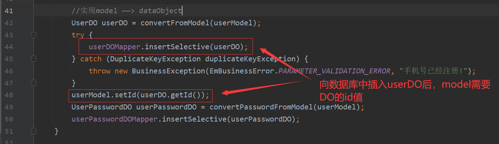

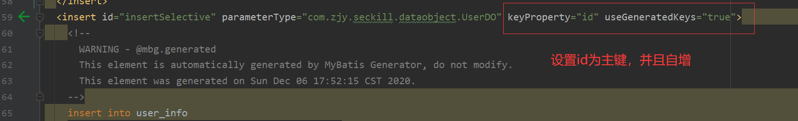

### 2.7 Validator的使用

#### 2.7.1 首先导包

```xml
        <!-- https://mvnrepository.com/artifact/org.hibernate.validator/hibernate-validator -->
        <dependency>
            <groupId>org.hibernate.validator</groupId>
            <artifactId>hibernate-validator</artifactId>
            <version>6.1.5.Final</version>
        </dependency>
```

#### 2.7.2 定义一个错误返回值的类

```java
public class ValidationResult {

    //校验结果是否有错
    private boolean hasErrors = false;

    //存放信息的map
    Map<String, String> errorMsgMap = new HashMap<>();

    //通过格式化字符串信息获取错误结果的msg方法
    public String getErrMsg() {
        return StringUtils.join(errorMsgMap.values().toArray(), ",");
    }

    public boolean isHasErrors() {
        return hasErrors;
    }

    public void setHasErrors(boolean hasErrors) {
        this.hasErrors = hasErrors;
    }

    public Map<String, String> getErrorMsgMap() {
        return errorMsgMap;
    }

    public void setErrorMsgMap(Map<String, String> errorMsgMap) {
        this.errorMsgMap = errorMsgMap;
    }
}
```

#### 2.7.3 编写真正去检查错误的类

```java
@Component
public class ValidatorImpl implements InitializingBean {

    //javax.validation的Validator，由他去做检验
    private Validator validator;

    //实现校验方法并返回校验结果
    public ValidationResult validate(Object bean) {
        ValidationResult validationResult = new ValidationResult();
        Set<ConstraintViolation<Object>> constraintViolationSet = validator.validate(bean);
        if (constraintViolationSet.size() > 0) {
            //有错误
            validationResult.setHasErrors(true);
            constraintViolationSet.forEach(constraintViolation -> {
                //获取错误信息
                String errMsg = constraintViolation.getMessage();
                //哪个字段发生了什么样的错误
                String propertyName = constraintViolation.getPropertyPath().toString();
                validationResult.getErrorMsgMap().put(propertyName, errMsg);
            });
        }
        return  validationResult;
    }

    @Override
    public void afterPropertiesSet() throws Exception {
        //将hibernate validator通过工厂的初始化方式使其实例化
        this.validator = Validation.buildDefaultValidatorFactory().getValidator();
    }
}
```

#### 2.7.4 在需要校验的字段上添加注解

如下图片所示：

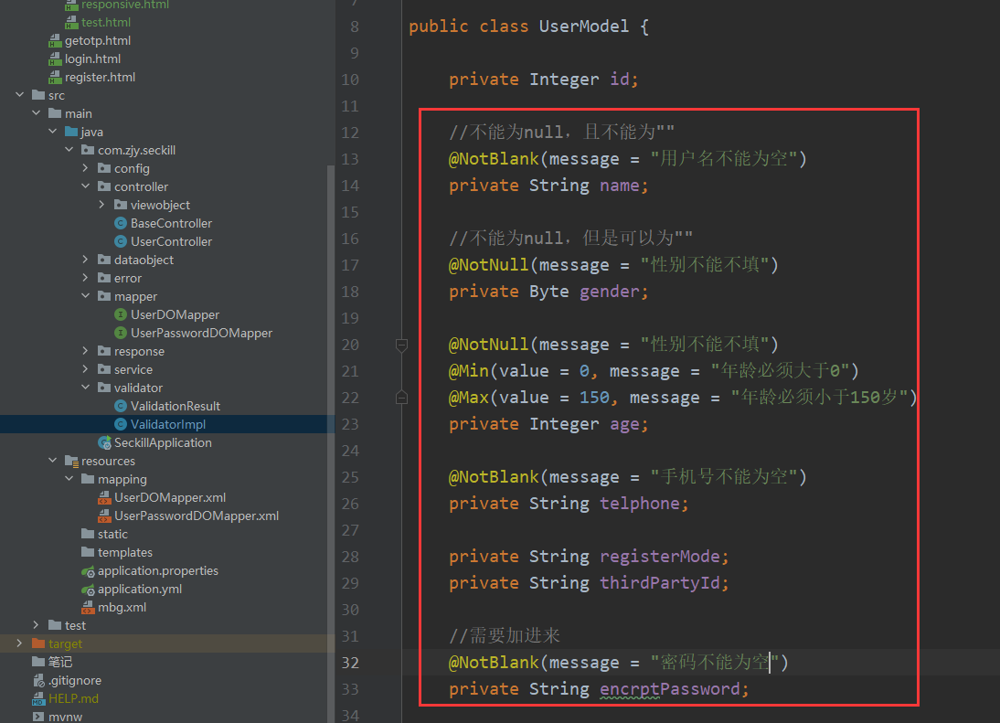

#### 2.7.5 具体使用：

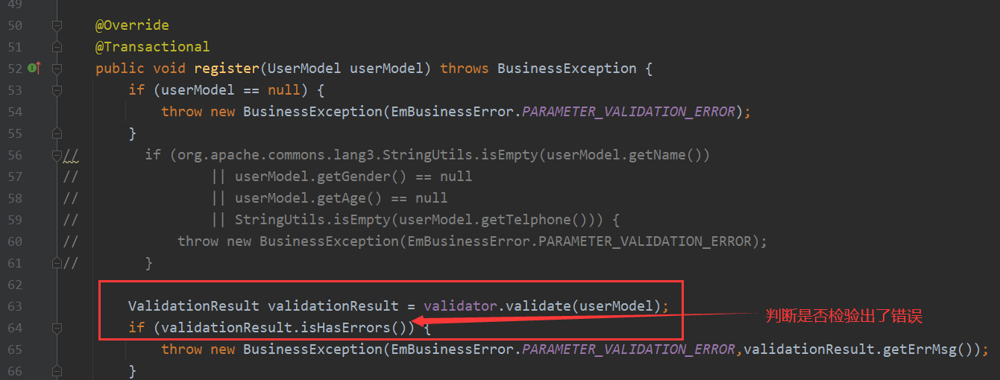

### 2.8 业务中的事务

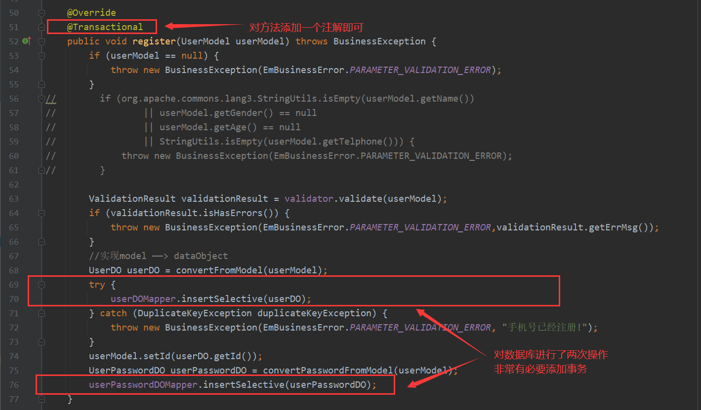


### 2.9 商品模型的建立—数据库设计思想

在前面的用户模型设计中，先是在数据库中建好了字段，然后采用生成插件生成对应的DO,DAO。但是老师讲了，在实际的开发中，我们第一步做的不应该是去数据库中建表，而是先设计好领域模型。即(xxxModel)

#### 2.9.1 item表的设计

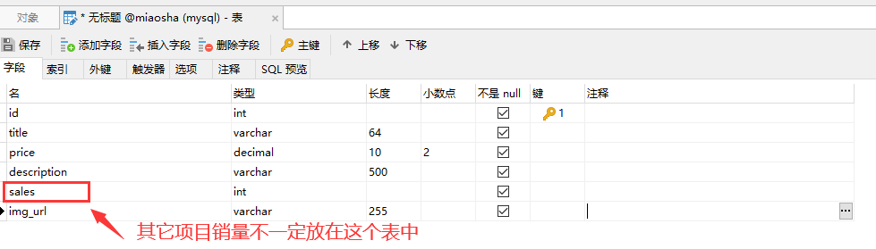

#### 2.9.2 销量表的设计

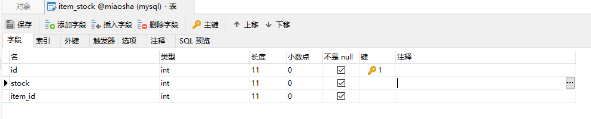

由于double类型向前端传送数据时，可能会产生精度问题，因此这里要用BigDecimal的类型

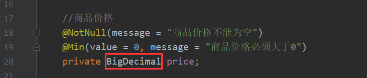

### 2.10 jdk8流式操作

在itemServiceImpl中运用到了流式操作，我个人觉得非常炫酷，特此记录一下。利用这个特性，十分酷地将List<ItemDO>转换为了List<ItemModel>。

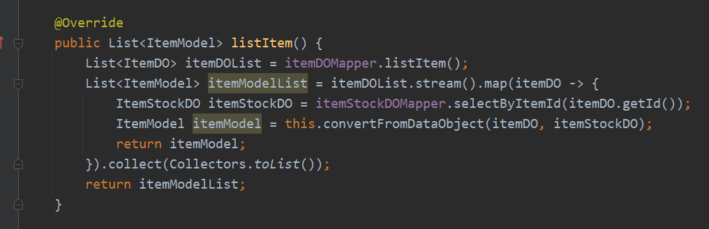


### 2.11 下单策略，落单减库存？支付减库存？

### 2.12 事务的Propagation属性

OrderServiceImpl的createOrder声明了一个事务，其中会根据日期和序列生成订单号，如果这个订单没有成功提交，那么就会回滚，但是我们不希望生成的订单号也一起回滚，想要达到全局唯一性。也就是说，不论订单是否成功提交，订单号都会生成，下一个订单号的信息会继续向前走（前提是这个事务自身没有问题）。

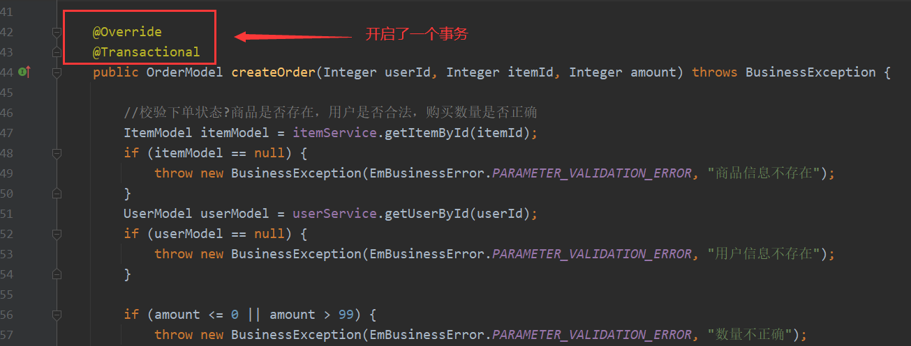

可以在生成订单的方法上也添加事务直接，但赋予了属性。

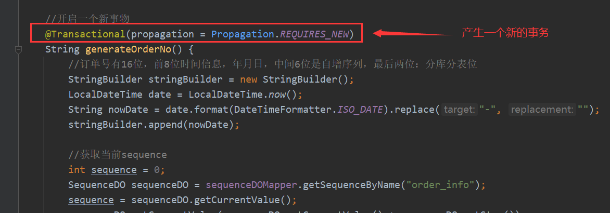


### 2.13 前端获取数据的形式

如下图片所示，第一个data是后端传来的CommonReturnType，同时在CommonReturnType中也定义了data属性和status属性。

虽然错误被捕获时，CommonReturnType中的data是一个Map，java层面是要通过Map.get(key)的方法获取对应的value的，但是前端上直接用.的方式替代了get()方法，如下图所示。

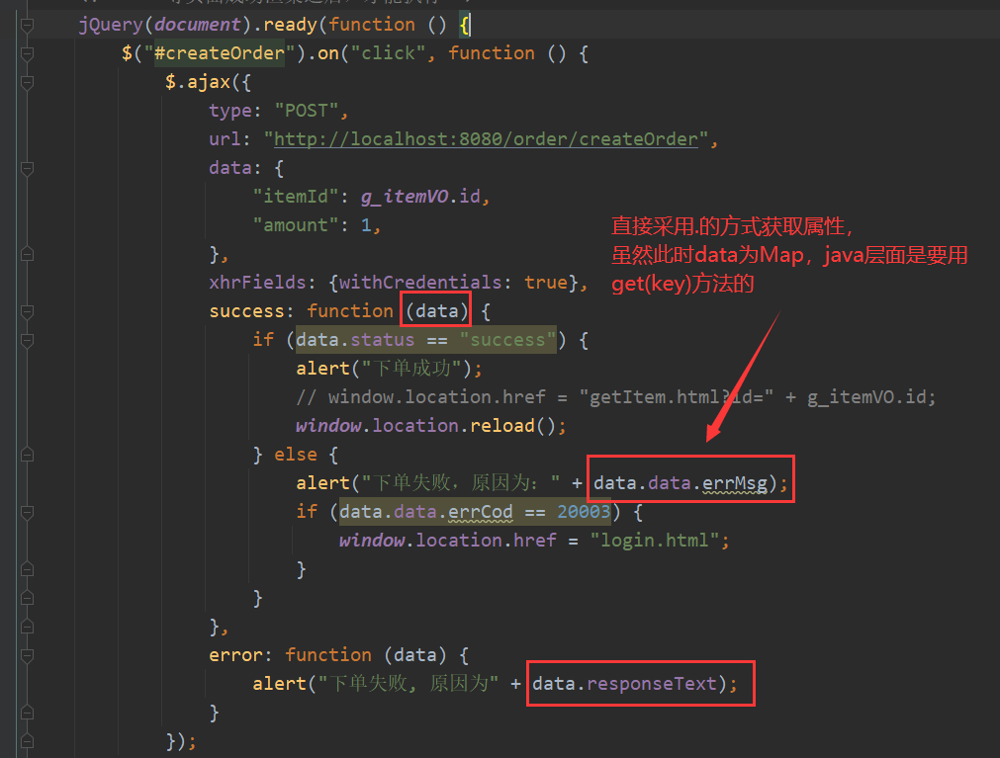

### 2.14 sql的加锁

生成订单号时，需要查询数据库中sequence，若存在多线程的情况，则查询数据有可能出现错误（别的线程可能修改了数据），因此需要加锁，在这里采用了select for update来加上行锁（查询依据name为主键，因此为行锁；行锁和表锁，具体可参考下面的资料）

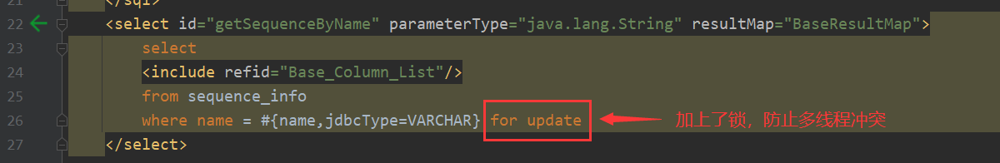

参考资料：

https://zhuanlan.zhihu.com/p/143866444

## *附录 遇到的 BUG*

### 1 jQuery突然失效

我佛了，前端页面的jQuery突然失效了，我下午刚来的时候还是正常的····重新建个分支，回退一下看看

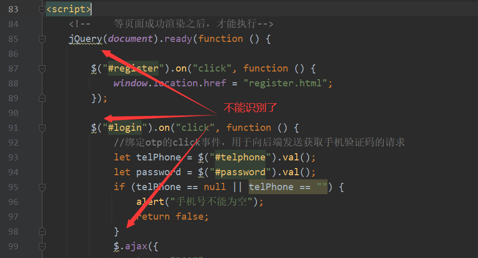

我佛了，把本地的前端分支给删掉了，并且应该是选择了delete tracked，把github上面的分支也给删掉了，幸好我台式机里新建了一个分支，笔记本里面应该还有保存，晚上回去再试试，现在还是专注于后端编写吧，加快速度把项目重新过一遍，前端页面也玩了玩。

emmm我把自己的前端页面和对应的资源文件放在另一个路径下，问题就没有了···神奇

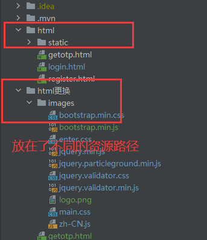

### 2 页面跳转问题

在2.2.1中我也讲了前端页面添加return false的情况，让我印象更为深刻的是这里：

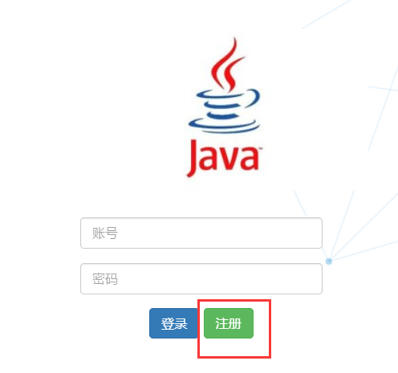

如上图我的登录页面，我的设计目的是输入信息之后点击登录，可以进入到首页；点击注册到时候，可以进入注册界面，然而最开始点击注册的时候，进入了一个错误页面：

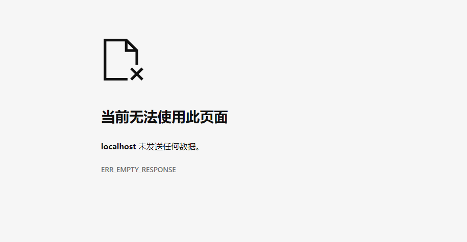

解决方法：添加return false：

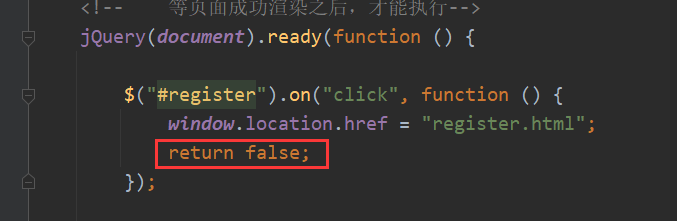

这应该是form表单的问题，老师在课程中也提到了

奇怪的是课程提供的前端页面，没有设置也能够跳转成功。。。

另外一种解决方法是把submit属性改成button，就不用添加return false了。参考资料2

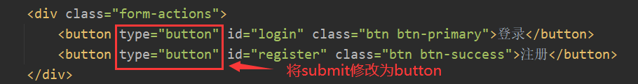

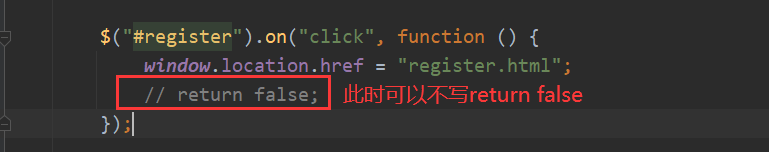


参考资料：

1. https://blog.csdn.net/yjz_sdau/article/details/82315591?utm_medium=distribute.pc_relevant_t0.none-task-blog-OPENSEARCH-1.control&depth_1-utm_source=distribute.pc_relevant_t0.none-task-blog-OPENSEARCH-1.control
2. https://www.cnblogs.com/leongirl/p/6690507.html

### 3 创建商品，没有反应


原因：

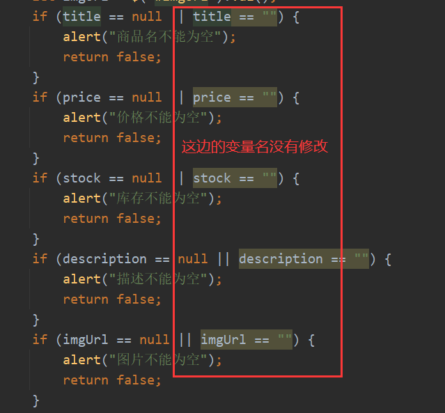

但是有出现了一个新的问题，提交之后，能够进入到数据库，说明提交成功，但是页面没有alert弹窗出现，交互特别差。

当我把

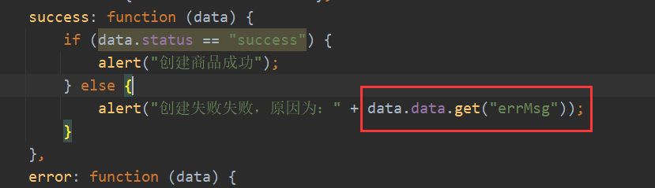

改为


后就有弹窗了，只不过弹出的是错误信息，但是数据库中还添加了商品，真是佛了


DEBUG了一下：

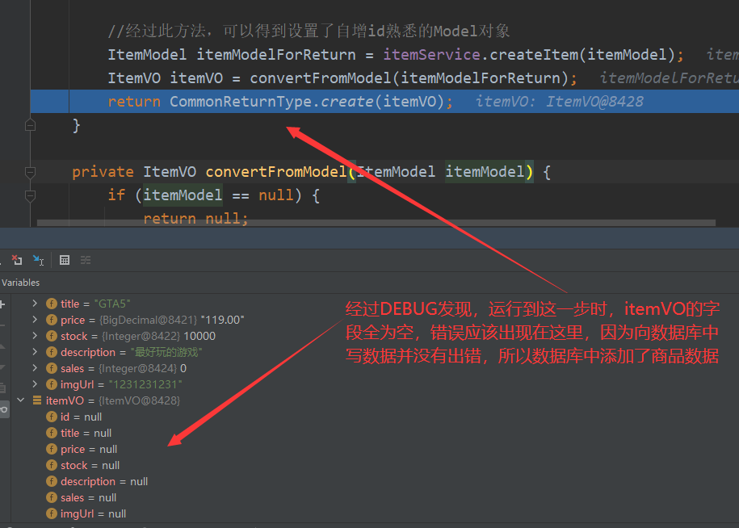

**哈哈，原因找到了，原来是我的ItemVO类，只给出了属性，并没有给出get和set方法(重点应该是set)，加上方法之后，就一切正常了。**

我又重新测试了一下，前端页面换成后也能成功创建商品并弹出alerti信息。我建议还是采用这种方式，因为有异常时，data是定义的map，map可以调用get方法来获取其中的异常信息。

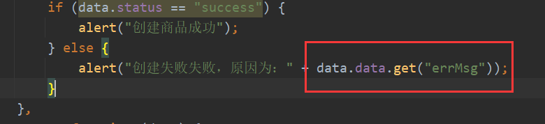

### 4 无法建立promo表

建立promo表时出现下图错误：

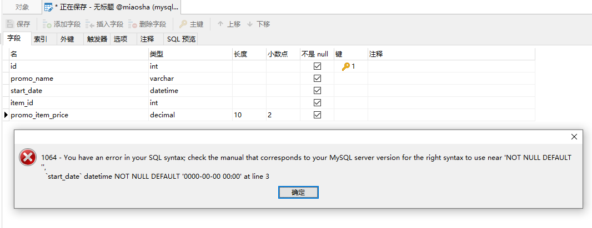

按照这种方式，并不能解决：https://www.cnblogs.com/xmnote/p/11651491.html 重启mysql服务后也不能解决。。

于是从之前的数据库中复制了这张表···醉了

经过我的测试，发现datetime列，需要手动加上长度和小数点的数值，0

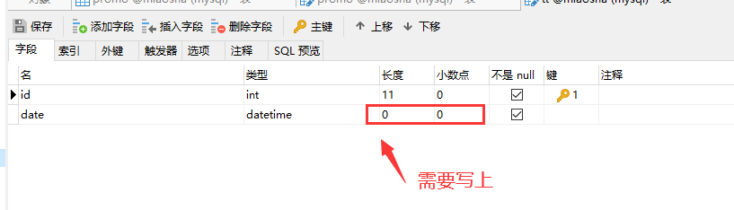

