# 秒杀项目——笔记

------

## *1 基础搭建*


#### 

### 1.1 新建数据库


#### 1.1.1 user_info表

注意这个表里是没有密码字段的，因为密码一般会加密，所以密码跟用户的主表是需要分开存储的


#### 1.1.2  user_password表

密码都是以密文存储在数据库中的,user_id对应user表的键


#### 1.1.3 order_info表

下单表的设计


#### 1.1.4设置索引

手机号对应唯一账号，因此注册时不允许已经注册过的手机再次注册，需要在user_info表中添加手机号的唯一索引，如图所示：


同时在ServiceImpl中，需要捕获由索引产生的异常


### 1.2 生成DO和Mapper

使用Mybatis_Generator自动生成DO,Dao,Mapper文件，需要注意的是，需要将IDEA中的sqldialects设置为none，否则*mapper.xml一些字段会报错


**非常需要注意的一点是，使用generator生成文件时，需要更改一下设置，否则生成的mapper.xml文件中，每一个方法，Map等都会生成多个，造成项目跑不起来，具体修改见下图。第一次做这个项目时我怎么没有遇到这个问题，同时将配置类中的自动覆盖打开，否则生成的dao和pojo也会出现两对，具体见图**

为什么要删除这项配置，见网页：[Mybatis Generator 生成代码重复 - muzi1994的个人空间 - OSCHINA - 中文开源技术交流社区](https://my.oschina.net/u/2289161/blog/1589644)


原因：


### 1.3 controller层对user类的映射

同样的，用于核心处理的类并不一定就是传给前端展示的类，比如我们肯定不能向前端传递密码等重要信息，因此在controller层，还需要再进行一次转化

**一般情况下，ViewObject的属性多于ModelObject多于DataObject**


### 1.4 通用返回类型，异常处理

#### 1.4.1 异常的设置

这两个类的编写，理论上可以应用到其它很多项目上

先来看看通用返回类型`CommonReturnType.java`

```java
public class CommonReturnType {

    //表明返回结果的情况，success,fail
    private String status;
    //若success，则data返回前端需要的json数据
    //若fail，则data使用通用的错误码格式
    private Object data;

    //定义一个通用的创建方法，默认状态是success
    public static CommonReturnType create(Object data) {
        return CommonReturnType.create(data, "success");
    }

    public static CommonReturnType create(Object data, String status) {
        CommonReturnType commonReturnType = new CommonReturnType();
        commonReturnType.setData(data);
        commonReturnType.setStatus(status);
        return commonReturnType;
    }

    public String getStatus() {
        return status;
    }

    public void setStatus(String status) {
        this.status = status;
    }

    public Object getData() {
        return data;
    }

    public void setData(Object data) {
        this.data = data;
    }
}
```

异常类的通用方法接口，`CommonError.java`

```java
public interface CommonError {

    int getErrCode();
    String getErrMsg();
    CommonError setErrMsg(String errMsg);
}
```

具体的异常类，`BusinessException.java`

```java
public class BusinessException extends Exception implements CommonError{

    private CommonError commonError;

    //直接接收EmBusinessError用于构造业务异常
    public BusinessException(CommonError commonError) {
        //注意这里调用super()
        super();
        this.commonError = commonError;
    }

    //接受自定义errMsg的方式构造业务异常
    public BusinessException(CommonError commonError, String errMsg) {
        super();
        this.commonError = commonError;
        this.commonError.setErrMsg(errMsg);
    }

    @Override
    public int getErrCode() {
        return this.commonError.getErrCode();
    }

    @Override
    public String getErrMsg() {
        return this.commonError.getErrMsg();
    }

    @Override
    public CommonError setErrMsg(String errMsg) {
        this.setErrMsg(errMsg);
        return this;
    }
}
```

一个枚举类，用于定义项目中出现的异常，`EmBusinessError.java`

同时这里需要系统学习下枚举类的知识

```java
public enum EmBusinessError implements CommonError {

    //通用错误类型
    PARAMETER_VALIDATION_ERROR(10001, "参数不合法"),
    UNKNOWN_ERROR(10002, "未知错误"),

    //2000开头为用户信息相关错误
    USER_NOT_EXIST(20001, "用户不存在"),


    ;

    private int errCode;
    private String errMsg;

    EmBusinessError(int errCode, String errMsg) {
        this.errCode = errCode;
        this.errMsg = errMsg;
    }

    @Override
    public int getErrCode() {
        return this.errCode;
    }

    @Override
    public String getErrMsg() {
        return this.errMsg;
    }

    @Override
    public CommonError setErrMsg(String errMsg) {
        this.errMsg = errMsg;
        return this;
    }
}
```

#### 1.4.2 自定义异常的捕获

编写了一个BaseController，并且让其它的Controller继承这个Controller


#### 1.4.3 高级的异常捕获——包含404等

在付费课程中，老师介绍了另一种异常捕获的方式。

先给出步骤：

1. 配置yml

   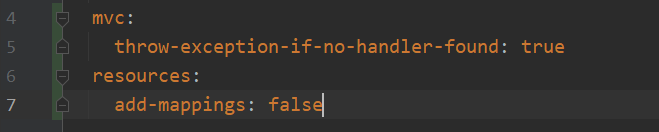

2. 编写一个异常捕获类

```java
@RestControllerAdvice
public class GlobalExceptionController {

    @ExceptionHandler(Exception.class)
    public CommonReturnType doError(HttpServletRequest httpServletRequest, HttpServletResponse httpServletResponse, Exception exception) {

        exception.printStackTrace();
        Map<String, Object> responseData = new HashMap<>();

        if (exception instanceof BusinessException) {
            BusinessException businessException = (BusinessException) exception;
            responseData.put("errorCode", businessException.getErrCode());
            responseData.put("errorMsg", businessException.getErrMsg());
        } else if (exception instanceof ServletRequestBindingException) {
            responseData.put("errorCode", EmBusinessError.UNKNOWN_ERROR.getErrCode());
            responseData.put("errorMsg", "url绑定路由问题");
        } else if (exception instanceof NoHandlerFoundException) {
            responseData.put("errorCode", EmBusinessError.UNKNOWN_ERROR.getErrCode());
            responseData.put("errorMsg", "没有找到对应的访问路径");
        } else {
            responseData.put("errorCode", EmBusinessError.UNKNOWN_ERROR.getErrCode());
            responseData.put("errorMsg", exception.getMessage());
        }

        return CommonReturnType.create(responseData, "fail");
    }
}
```


## *2 业务构建*

### 2.1 threadLocal的应用


### 2.2 ajax小知识（contentType）

#### 2.2.1 from表单中添加false的重要性

如下图所示，在两处添加了return false的代码，第一次接触的时候没感觉到有什么用，但是当我用自己的前端页面时，出现了一个新的问题，见BUG 2.


#### 2.2.2 contentType属性

如上图所示，在ajax请求中设置了contentType属性，意义如下：

将需要提交的数据发送出去后，还要服务端解析成功才有意义。一般服务端语言如 php、python 等，以及它们的 framework，都内置了自动解析常见数据格式的功能。服务端通常是根据请求头（headers）中的 Content-Type 字段来获知请求中的消息主体是用何种方式编码，再对主体进行解析。

这里设置的application/x-www-form-urlencoded是默认的数据格式。如果原生的form表单不设置该属性，就会以这种方式提交数据。

具体的讲解，见——[Ajax 请求头中常见content-type - itjeff - 博客园 (cnblogs.com)](https://www.cnblogs.com/itjeff/p/10240124.html)


同理在Mapping中，也需要设置对应的contentType，用来设定处理什么格式的信息。

引用一张图片：感谢[RequestMapping中的参数consumes 与 produces_游湖虾_新浪博客 (sina.com.cn)](http://blog.sina.com.cn/s/blog_6472d0800102xjpm.html)


### 2.3 前端编写，引入样式

感觉自己做项目还是采用前后端分离的形式好一些，直接把html文件放入项目的主路径下，采用ajax和jquery传递数据。不然每次把前端和静态资源放入resources路径中，样式总是加载不出来。


这样样式就能够出来了

### 2.4 解决跨域问题

将短信验证码存放在了session中，这里存在跨域问题，注意此时我的springboot版本是2.3.2.release

这篇博客对于同源策略讲解的比较清晰：[SpringBoot配置Cors解决跨域请求问题 - 袁老板 - 博客园 (cnblogs.com)](https://www.cnblogs.com/yuansc/p/9076604.html)

关于springboot2.4的解决方法：[springboot2.4.0跨域问题 - 技术交流 - SpringBoot中文社区](https://springboot.io/t/topic/2986)

原因等后面整理项目面试的时候再具体看看吧，先降到2.3.2.release版本。。。

解决方法：

1. 后端的Controller定义处

   

2. 前端


此处还有一个坑就是，当你的springboot版本升高时，比如我之前使用了2.4.0版本，运行项目会报错，当我换成2.3.2.release之后，就能成功运行起来了。。。

这是部分错误信息

```
org.springframework.beans.factory.BeanCreationException: Error creating bean with name 'requestMappingHandlerMapping' defined in class path resource [org/springframework/boot/autoconfigure/web/servlet/WebMvcAutoConfiguration$EnableWebMvcConfiguration.class]: Invocation of init method failed; nested exception is java.lang.IllegalArgumentException: When allowCredentials is true, allowedOrigins cannot contain the special value "*"since that cannot be set on the "Access-Control-Allow-Origin" response header. To allow credentials to a set of origins, list them explicitly or consider using "allowedOriginPatterns" instead.


Caused by: java.lang.IllegalArgumentException: When allowCredentials is true, allowedOrigins cannot contorg.springframework.beans.factory.support.AbstractAutowireCapableBeanFactory.initializeBean(AbstractAutowireCapableBeanFactory.java:1784) ~[spring-beans-5.3.1.jar:5.3.1]
	... 22 common frames omitted
```

### 2.5 密码加密的注意事项

前端传来密码时，需要对密码进行加密，直接用md5加密不行，要特殊操作一下

```java
    private String encodeByMd5(String password) throws UnsupportedEncodingException, NoSuchAlgorithmException {
        //确定计算方法
        MessageDigest md5 = MessageDigest.getInstance("MD5");
        BASE64Encoder base64Encoder = new BASE64Encoder();
        //加密字符串
        String newPassword = base64Encoder.encode(md5.digest((password.getBytes("utf-8"))));
        return newPassword;
    }
```

### 2.6  mapper.xml中设置主键和自增

在`userServiceImpl`中，需要注意如下图片所示的情况，并且mapper.xml文件中，KeyProperty对应的值，是java类中的属性名称，并非数据库中的字段名（实际上大多数情况下都一样，但是需要知道这点，以防万一）

可参考：

[keyProperty="id" 和useGeneratedKeys="true"作用 - 【曾】那时年少 - 博客园 (cnblogs.com)](https://www.cnblogs.com/zenghuilong/p/10276831.html)

[Mybatis配置useGeneratedKeys="true" keyProperty="id"的作用 - Code2020 - 博客园 (cnblogs.com)](https://www.cnblogs.com/cxy2020/p/13141997.html)


### 2.7 Validator的使用

#### 2.7.1 首先导包

```xml
        <!-- https://mvnrepository.com/artifact/org.hibernate.validator/hibernate-validator -->
        <dependency>
            <groupId>org.hibernate.validator</groupId>
            <artifactId>hibernate-validator</artifactId>
            <version>6.1.5.Final</version>
        </dependency>
```

#### 2.7.2 定义一个错误返回值的类

```java
public class ValidationResult {

    //校验结果是否有错
    private boolean hasErrors = false;

    //存放信息的map
    Map<String, String> errorMsgMap = new HashMap<>();

    //通过格式化字符串信息获取错误结果的msg方法
    public String getErrMsg() {
        return StringUtils.join(errorMsgMap.values().toArray(), ",");
    }

    public boolean isHasErrors() {
        return hasErrors;
    }

    public void setHasErrors(boolean hasErrors) {
        this.hasErrors = hasErrors;
    }

    public Map<String, String> getErrorMsgMap() {
        return errorMsgMap;
    }

    public void setErrorMsgMap(Map<String, String> errorMsgMap) {
        this.errorMsgMap = errorMsgMap;
    }
}
```

#### 2.7.3 编写真正去检查错误的类

```java
@Component
public class ValidatorImpl implements InitializingBean {

    //javax.validation的Validator，由他去做检验
    private Validator validator;

    //实现校验方法并返回校验结果
    public ValidationResult validate(Object bean) {
        ValidationResult validationResult = new ValidationResult();
        Set<ConstraintViolation<Object>> constraintViolationSet = validator.validate(bean);
        if (constraintViolationSet.size() > 0) {
            //有错误
            validationResult.setHasErrors(true);
            constraintViolationSet.forEach(constraintViolation -> {
                //获取错误信息
                String errMsg = constraintViolation.getMessage();
                //哪个字段发生了什么样的错误
                String propertyName = constraintViolation.getPropertyPath().toString();
                validationResult.getErrorMsgMap().put(propertyName, errMsg);
            });
        }
        return  validationResult;
    }

    @Override
    public void afterPropertiesSet() throws Exception {
        //将hibernate validator通过工厂的初始化方式使其实例化
        this.validator = Validation.buildDefaultValidatorFactory().getValidator();
    }
}
```

#### 2.7.4 在需要校验的字段上添加注解

如下图片所示：


#### 2.7.5 具体使用：


### 2.8 业务中的事务


### 2.9 商品模型的建立—数据库设计思想

在前面的用户模型设计中，先是在数据库中建好了字段，然后采用生成插件生成对应的DO,DAO。但是老师讲了，在实际的开发中，我们第一步做的不应该是去数据库中建表，而是先设计好领域模型。即(xxxModel)

#### 2.9.1 item表的设计


#### 2.9.2 销量表的设计


由于double类型向前端传送数据时，可能会产生精度问题，因此这里要用BigDecimal的类型


### 2.10 jdk8流式操作

在itemServiceImpl中运用到了流式操作，我个人觉得非常炫酷，特此记录一下。利用这个特性，十分酷地将List<ItemDO>转换为了List<ItemModel>。


### 2.11 下单策略，落单减库存？支付减库存？

### 2.12 事务的Propagation属性

OrderServiceImpl的createOrder声明了一个事务，其中会根据日期和序列生成订单号，如果这个订单没有成功提交，那么就会回滚，但是我们不希望生成的订单号也一起回滚，想要达到全局唯一性。也就是说，不论订单是否成功提交，订单号都会生成，下一个订单号的信息会继续向前走（前提是这个事务自身没有问题）。


可以在生成订单的方法上也添加事务直接，但赋予了属性。


### 2.13 前端获取数据的形式

如下图片所示，第一个data是后端传来的CommonReturnType，同时在CommonReturnType中也定义了data属性和status属性。

虽然错误被捕获时，CommonReturnType中的data是一个Map，java层面是要通过Map.get(key)的方法获取对应的value的，但是前端上直接用.的方式替代了get()方法，如下图所示。


### 2.14 sql的加锁

生成订单号时，需要查询数据库中sequence，若存在多线程的情况，则查询数据有可能出现错误（别的线程可能修改了数据），因此需要加锁，在这里采用了select for update来加上行锁（查询依据name为主键，因此为行锁；行锁和表锁，具体可参考下面的资料）


参考资料：

https://zhuanlan.zhihu.com/p/143866444

### 2.15 日期前端格式问题

不经过任何处理，在前端上面展示的日期格式是有问题的。此时的日期json格式如下所示：

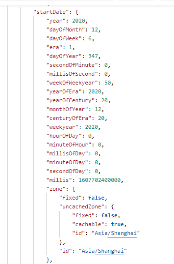

前端展示不出来：

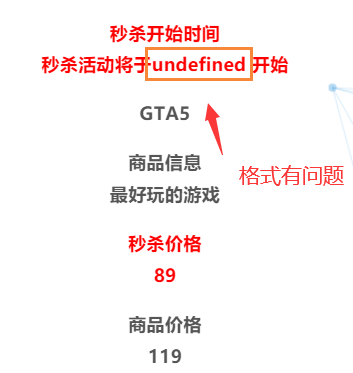

**解决方法**：将ItemVO的startDate类型改为String，同时给itemVO的startDate传值的时候，采用格式化字符串的形式。

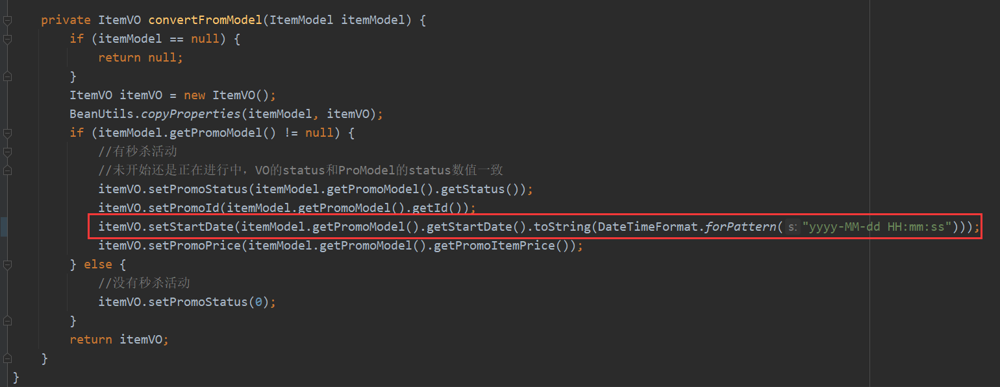

同时这里我还发现了我的两个小问题：

1. 格式化形式里面，我写成了"yyyy-mm-dd HH:mm:ss"，因此月份显示有问题。
2. 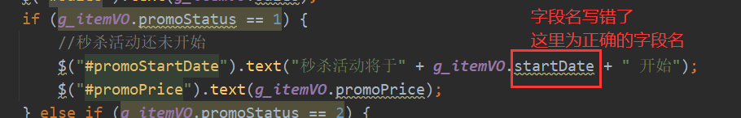

### 2.16 前端的展示等等

关于前端的一些知识，例如定时刷新界面，根据条件展示什么信息这些操作，可以多多看看getItem.html的页面，掌握。

至此，基本的业务逻辑，搭建完毕。

## *3 云端部署*

### 3.1 JDK安装

1. 在远端linux（后面均称为服务器）的/tmp下放置jdk.rpm安装文件

   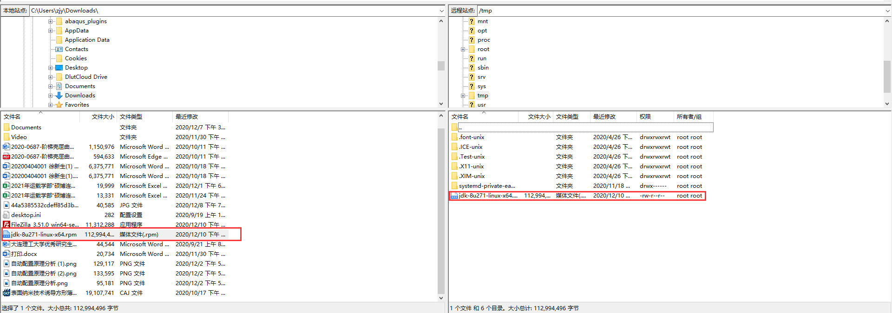

2. 修改权限

   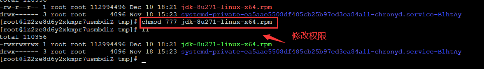

3. 安装

   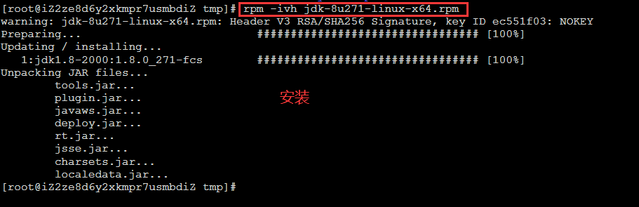

4. 设置环境变量

   ```bash
   vim ~/.bash_profile
   JAVA_HOME=/usr/java/jdk1.8.0_271-amd64
PATH=$PATH:$JAVA_HOME/bin
   ```

   

   修改，wq保存退出

   刷新环境变量
   
   ```bash
source ~/.bash_profile
   ```

   测试
   
   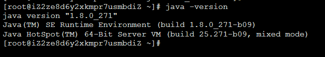

### 3.2 数据库环境

1. yum安装

   ```bash
   yum install mysql*
   ```

   ```bash
   yum install mariadb-server
   ```

   

2. 启动服务

   ```bash
   systemctl start mariadb.service
   ```

3. 测试

   ```bash
   ps -ef | grep mysql
   netstat -anp | grep 3306
   ```

   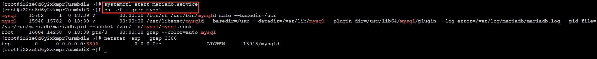

   

4. 设定密码

   ```bash
   mysqladmin -u root password 123123
   ```

   

5. 连接mysql

   ```bash
   mysql -uroot -p123123
   ```

   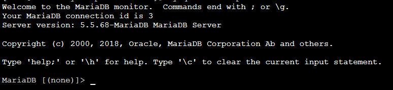

### 3.3 数据恢复

1. 切换mysql/bin/路径，打开cmd

   执行命令:

   ```bash
   mysqldump -uroot -p123123 --databases miaosha > E:\Mysql备份/miaosha.sql
   ```

   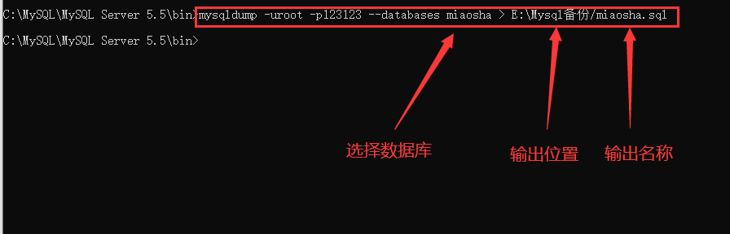

2. 将生成的sql文件上传到服务器tmp目录下

   ```bash
   scp E:\Mysql备份/miaosha.sql root@39.97.247.76:/tmp/
   ```

   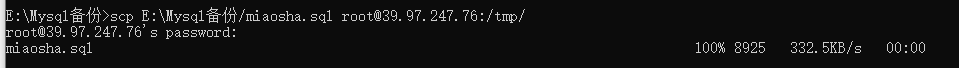

3. 执行命令

   ```bash
   mysql -uroot -p123123 < /tmp/miaosha.sql
   ```

4. 检查

   

### 3.4  部署jar包

1. 打jar包

   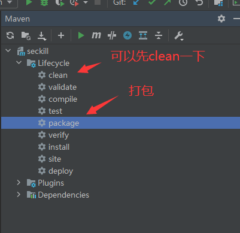

   注意pom文件中要有这个内容

   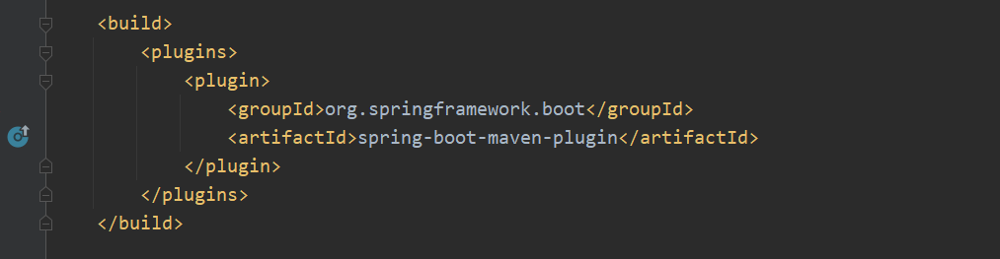

2. 上传jar包到服务器的tmp目录下

   ```bash
   scp E:\IdeaProjects\seckill-2020-12-6\target\seckill-1.0-SNAPSHOT.jar root@39.97.247.76:/tmp/
   ```

   

3. 将tmp目录下的jar包移动到服务器/var/www/miaosha/的目录下，并修改权限777

   注意新服务器，需要在安全组里面新建一个规则，开放端口范围，授权范围为0.0.0.0/0

   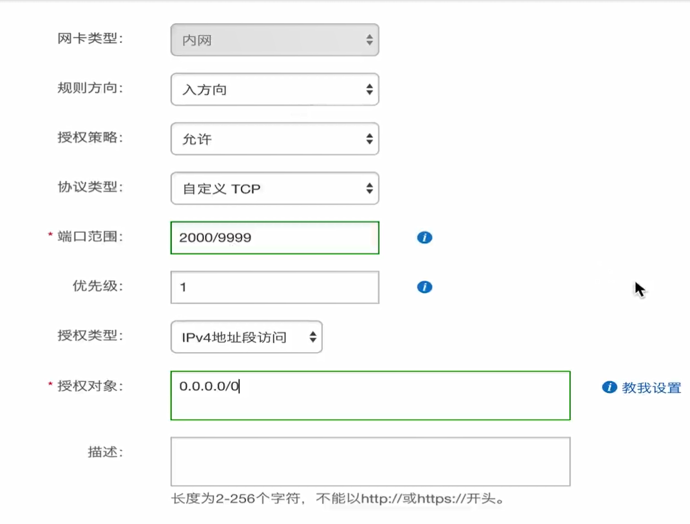

4. 运行

   ```bash
   java -jar miaoshao.jar
   ```

   在浏览器输入地址：`39.97.247.76:8080`，出现页面，代表部署成功

   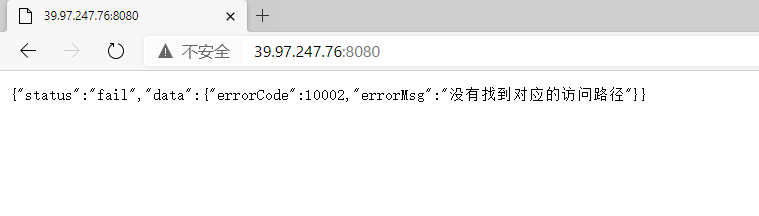

### 3.5 云端部署策略

#### 3.5.1 脚本启动

这是外挂配置文件启动，不推荐

```bash
java -jar miaosha.jar --spring.config.additon-location=/var/www/miaosha/applicaiton.properties
```

**编写启动脚本**

```bash
vim deploy.sh
内容：
nohup java -Xms400m -Xmx400m -XX:NewSize=200m -XX:MaxNewSize=200m -jar seckill-1.0-SNAPSHOT.jar --spring.config.addition-location=/var/www/miaosha/application.yml
```

在当前目录下启动脚本文件

```bash
./deploy.sh &
```

#### 3.5.2 关闭

```bash
ps -ef | grep java
```

查出java线程的ID号，然后kill即可

```bash
kill id
```

#### 3.5.3 多配置环境

在win10上开发中，可以有多个配置文件，运行的时候在application.yml中选择使用那个配置文件即可。

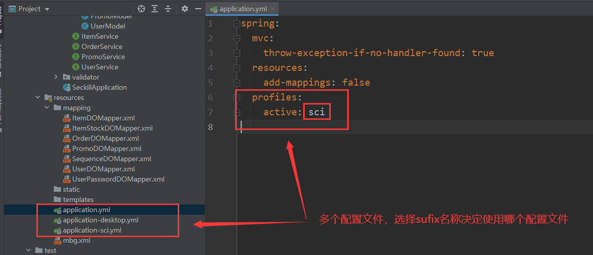

使用脚本运行时，外挂配置的名称要与sufix配置文件的完全相同

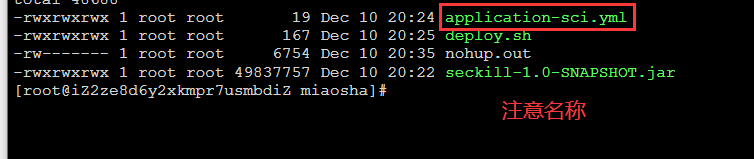

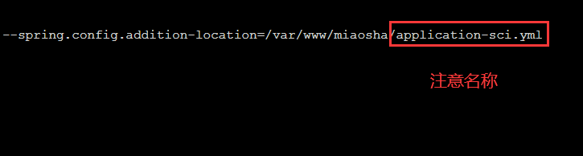

### 3.6 jmeter性能压测

#### 3.6.1 server端并发线程数上不去

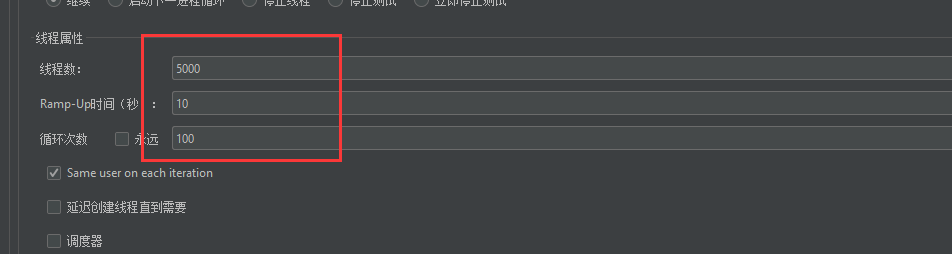

给jmeter设置一个高并发，当jemeter显示有错误请求时，查看最大线程数，可知最大线程数量为102

```bash
pstree -p id | wc -l  或
pstree id
```

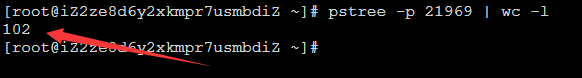

#### 2.6.2 更改tomcat配置

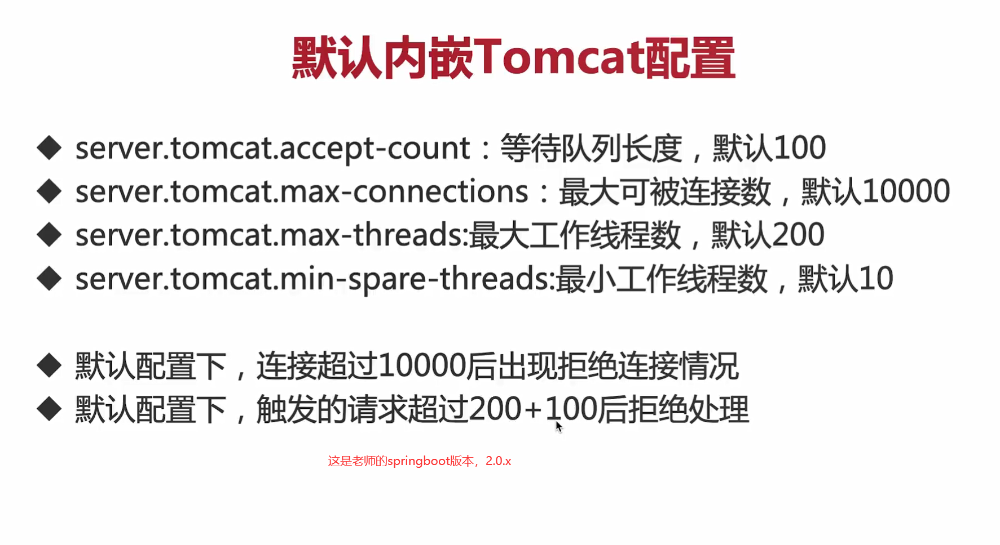

更改配置

```yam
server:
  tomcat:
    accept-count: 1000
    threads:
      max: 800
      min-spare: 100
```

此时的线程数量：

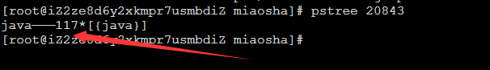

#### 2.6.3 定制化内嵌Tomcat开发

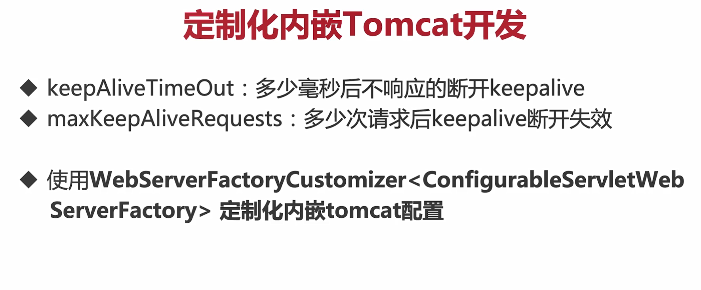

```java
@Component
public class WebServerConfiguration implements WebServerFactoryCustomizer<ConfigurableWebServerFactory> {
    @Override
    public void customize(ConfigurableWebServerFactory factory) {
        //使用对应工厂类提供的接口，定制化tomcat connector
        TomcatServletWebServerFactory serverFactory = (TomcatServletWebServerFactory) factory;
        serverFactory.addConnectorCustomizers(new TomcatConnectorCustomizer() {
            @Override
            public void customize(Connector connector) {
                Http11NioProtocol protocolHandler = (Http11NioProtocol) connector.getProtocolHandler();

                //定制化keepAliveTimeOut，设置30s内没有请求，服务端自动断开keep alive链接
                protocolHandler.setKeepAliveTimeout(30000);
                //当客户端发送超过10000个请求，则自动断开keep alive链接
                protocolHandler.setMaxKeepAliveRequests(10000);
            }
        });
    }
}
```


#### 2.6.4 发现容量问题—响应时间变长TPS上不去

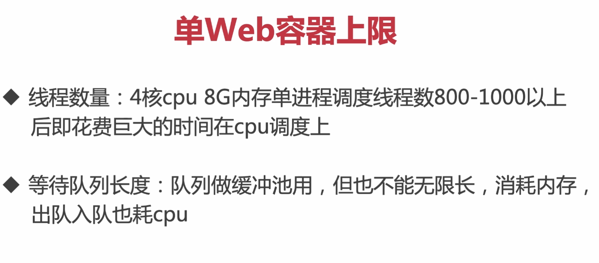

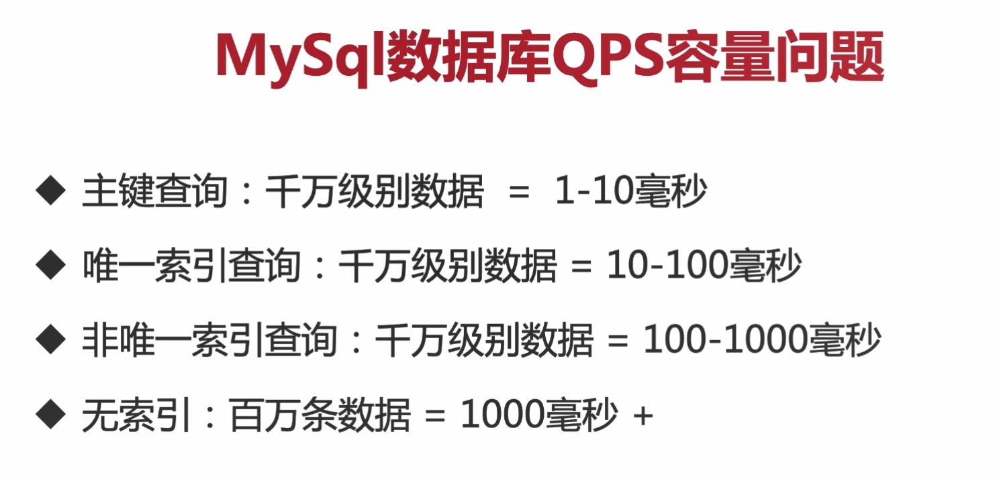

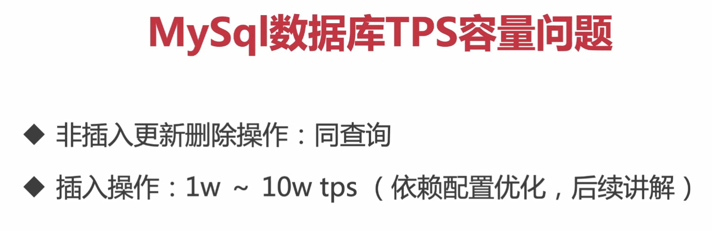

## *4 分布式扩展*

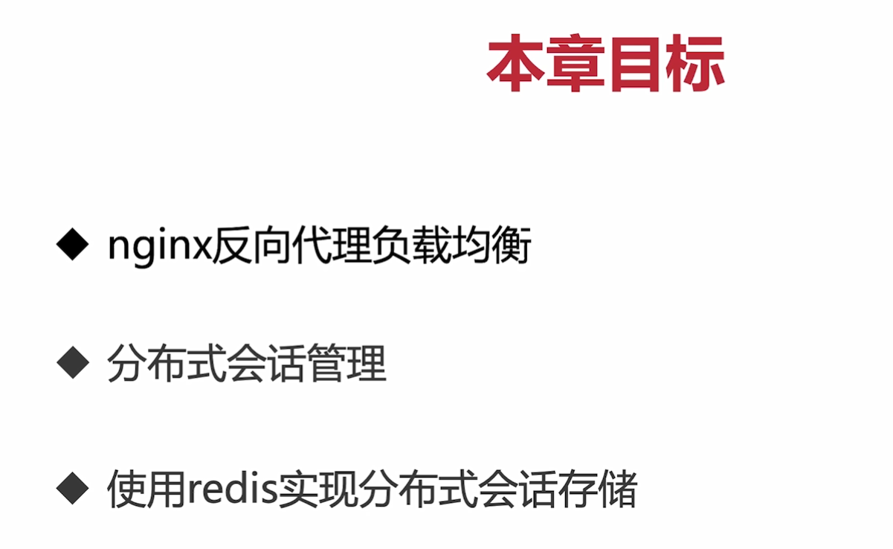

### 4.1 单机架构

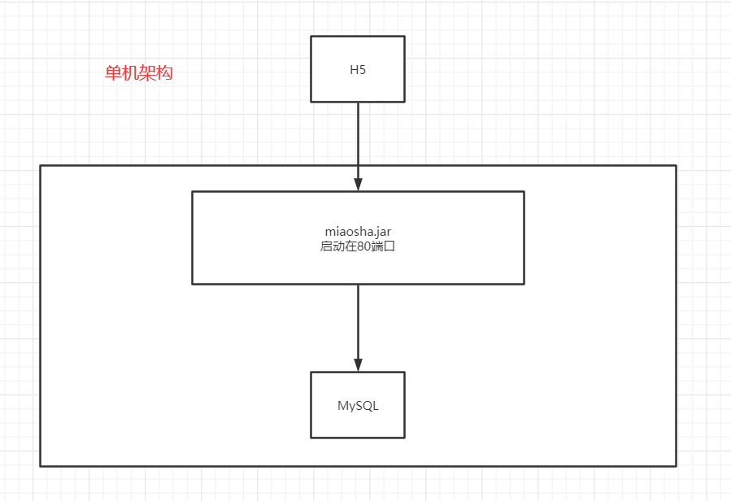

### 4.2 扩展后的架构

采用负载均衡的轮询策略去访问jar包所在的服务器


#### 4.2.1 数据库开放远端连接

1. 先在两台秒杀服务器上修改url连接

   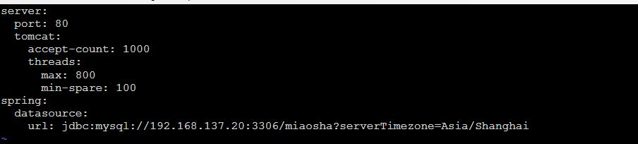

2. 查看配置（可跳过）但是得切换到这个数据库

   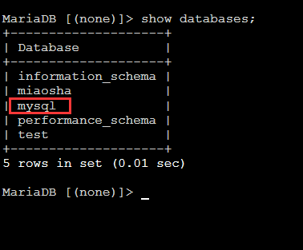

   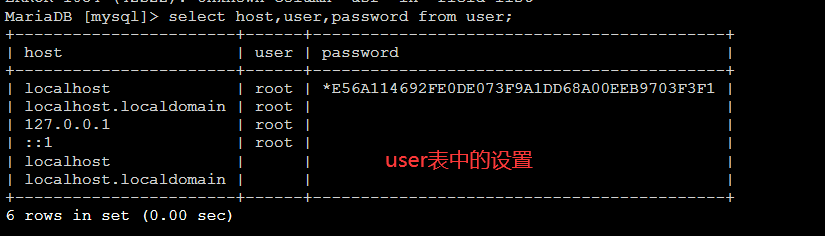

3. 修改配置

   ```bash
   设定所有知道root账号密码的远程服务器连接本数据库
   grant all privileges on *.* to root@'%' identified by '123123';
   ```

   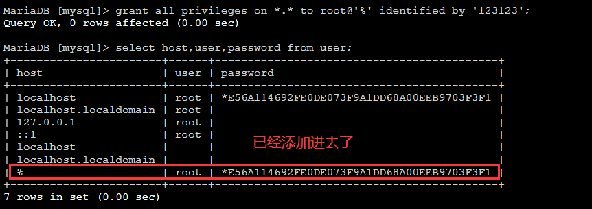

4. 更新配置

   ```bash
   flush privileges;
   ```

### 4.3 关闭防火墙

linux最好还是关机掉防火墙比较好，以免未知错误发生

```bash
systemctl status firewalld.service		//查看防火墙状态
systemctl stop firewalld.service		//关闭防火墙，重启后会开启
systemctl disable firewalld.service		//永久关闭防火墙, 重启后也是关闭的。建议按这3个步骤来执行
```


### 4.4 nginx反向代理

#### 4.4.1 nginx主要功能：

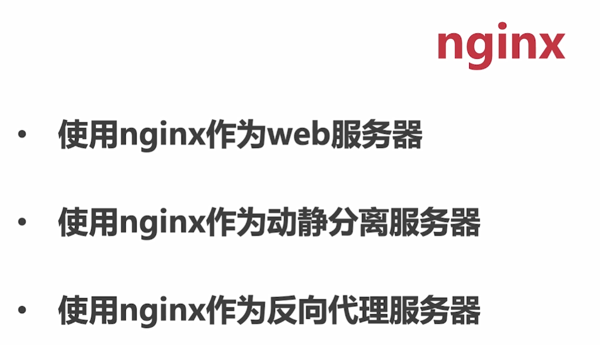

#### 4.4.2 引入nginx后的架构

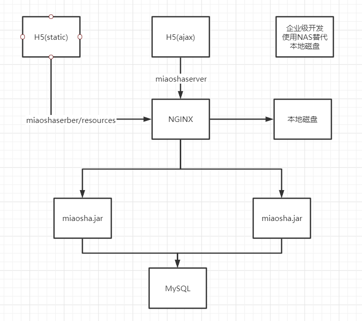

#### 4.4.3 设置全局主机地址

1. 在前端页面路径下新建一个`g_host.js`文件，便于其它页面引用地

   **在nginx服务器资源中中要把g_host的地址换成nginx服务器的地址**

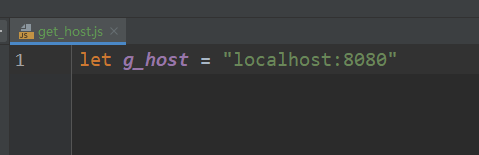

1. 在其它html页面输入url地址的地方更换：

   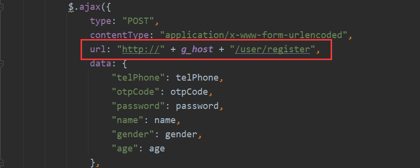

#### 4.4.4 安装nginx

1. 下载openresty安装包

   ```bash
   wget https://openresty.org/download/openresty-1.13.6.2.tar.gz
   ```

2. 解压

   ```bash
   tar -xvzf openresty-1.13.6.2.tar.gz 
   ```

3. 编译

   1. ```bash
      ./configure
      ```

      第一次使用这个命令的时候，提示： /usr/bin/env: perl: 没有那个文件或目录

      按这篇博客给出的方案来试一下：https://www.cnblogs.com/kinwing/p/11134202.html

      按顺序输入以下命令:

      ```bash
      yum install perl gcc kernel-devel
      yum upgrade kernel kernel-devel
      ```

      又报错了：

      需要执行以下命令解决：

      ```bash
      yum install pcre-devel openssl-devel gcc curl
      ```

      再执行./configure

   2. ```bash
      make
      ```

   3. ```bash
      make install
      ```

   4. 安装位置：`/usr/local/openresty`

#### 4.4.5 启动nginx

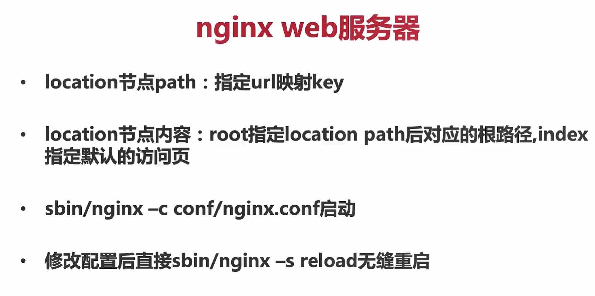

```bash
sbin/nginx -c conf/nginx.conf	启动
```

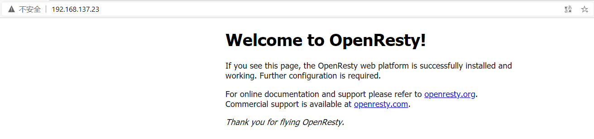

#### 4.4.6 部署前端资源

将前端资源全部放在`/usr/local/openresty/nginx/html`路径下，就可以访问网页了

为了实现访问静态资源和ajax请求的两条路线，首先更改nginx的配置

```bash
vi //usr/local/openresty/nginx/conf/nginx.conf
```

更改配置：

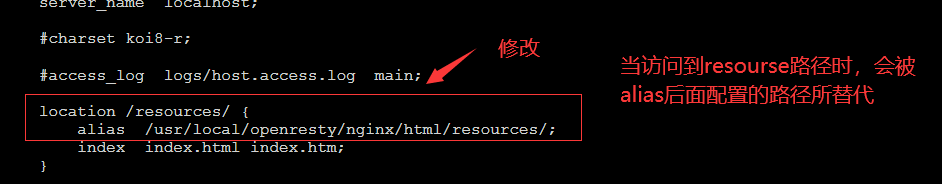

然后再html/路径下新建一个resours文件，将所有的网页资源放入到resources/路径下

#### 4.4.7 ngnix动静分离服务器

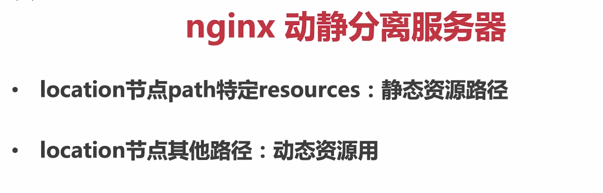

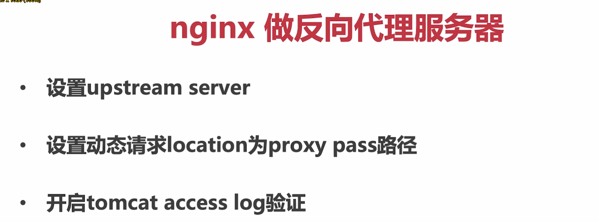


1. 修改nginx.conf配置:

   ```bash
       upstream backend_server{
           server 192.168.137.21 weight=1;
           server 192.168.137.22 weight=1;
       }
   ```

   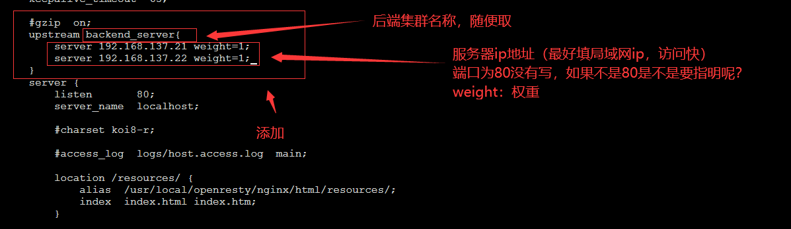

   

   ```bash
           location / {
           proxy_pass http://backend_server;
           proxy_set_header Host $http_host:$proxy_port;
           proxy_set_header X-Real-IP $remote_addr;
           proxy_set_header X-Forwarded-For $proxy_add_x_forwarded_for;
           }
   ```

   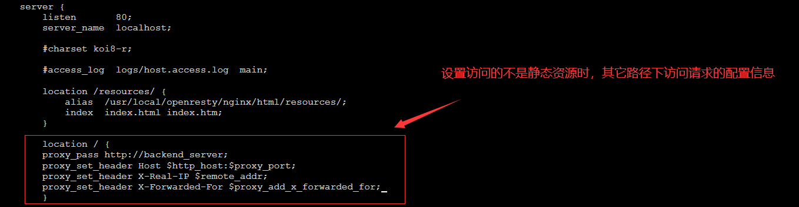

2. 开启tomcat access验证是否服务器均起到作用

   更新yml配置如下：注意pattern要被 '' 包起来

   ```yaml
   server:
     port: 80
     tomcat:
       accept-count: 1000
       threads:
         max: 800
         min-spare: 100
       accesslog:
         enabled: true
         directory: /var/www/miaosha/tomcat    #这里指明了地址
   #h:remote_host_ip, u:remote_user t:handle_cost_time r:request_url s:http_return:code b:bytes_send D:handle_cost_time
         pattern: '%h %l %u %t "%r" %s %b %D'
   spring:
     datasource:
       url: jdbc:mysql://192.168.137.20:3306/miaosha?serverTimezone=Asia/Shanghai
   ```

   在`/var/www/miaosha/`路径下新建tomcat文件，并且修改权限`chmod -R 777 tomcat`，作为日志的存放地址

   对服务器发起请求，若两个服务器下的日志文件均有输出，代表设置成功。

### 4.5 jmeter性能压测

因为我是采用的本地服务，所以压测结果均采用老师的结果，便于面试吹。

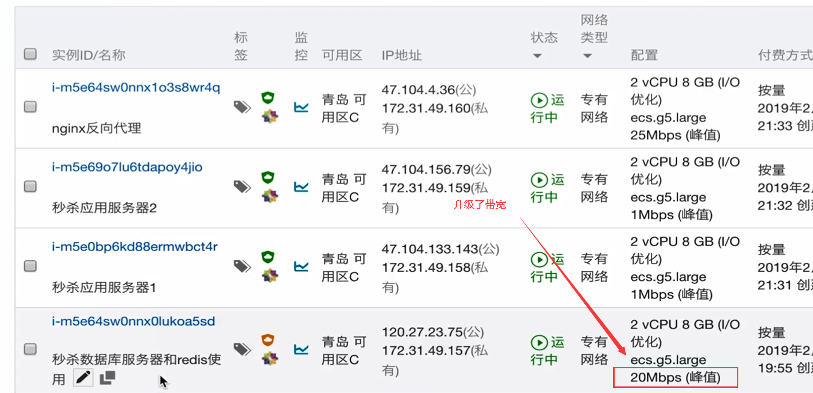

结果：

这是对数据库，java服务器都使用的那台服务器的压测结果，并没有用到分布式

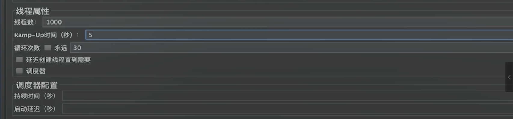

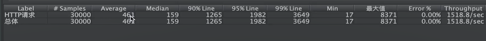

对nginx反向代理的压测（同样的压力）：

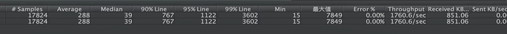

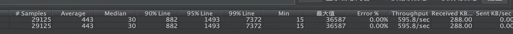

### 4.6 设置nginx于秒杀服务器的长连接

nginx于秒杀服务器的默认连接是短连接的，应该设置为长连接

```bash
keepalive 30;
proxy_http_version 1.1;
proxy_set_header Connection "";
```

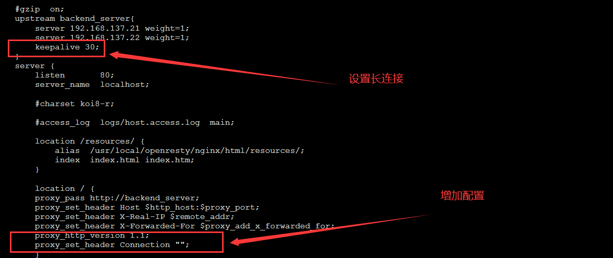

重新启动nginx

```bash
sbin/nginx -s reload
```

再测试：

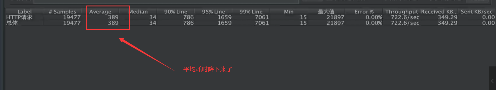

### 4.7 nginx高性能的原因！

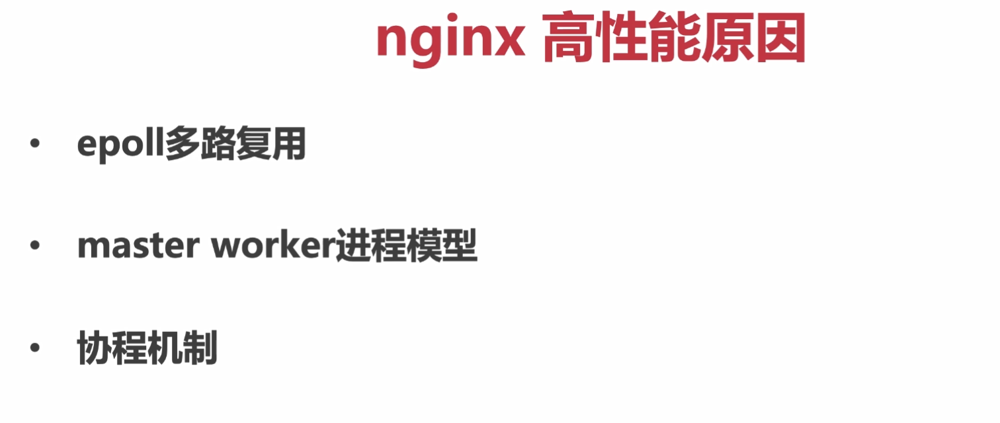

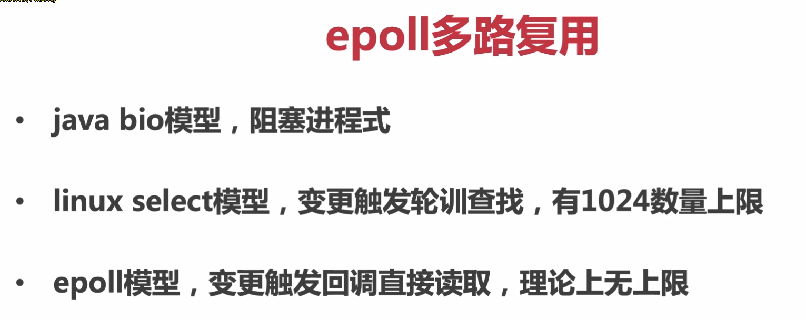

1. BIO模型：

   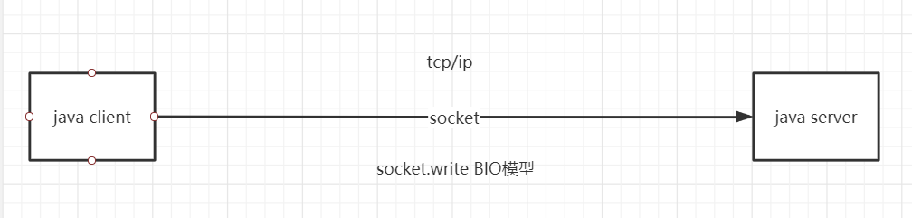

2. select多路复用

   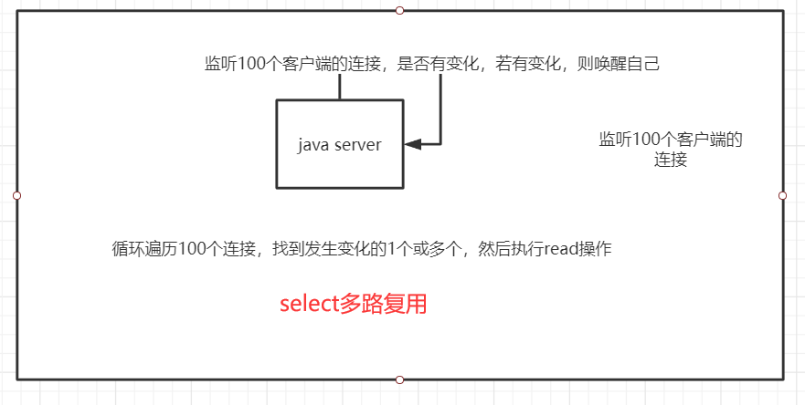

3. epoll模型

   

4. master-worker进程模型

   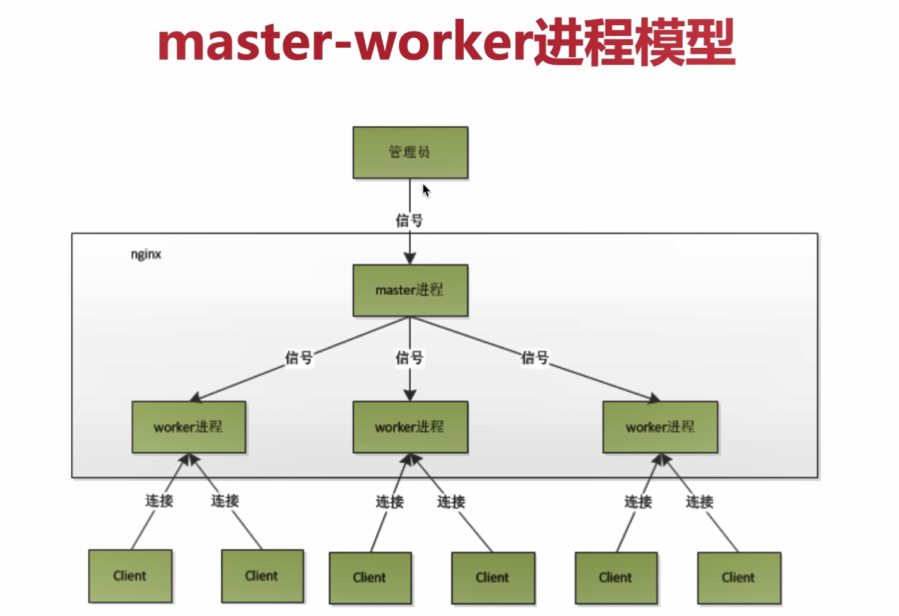

5. 携程

   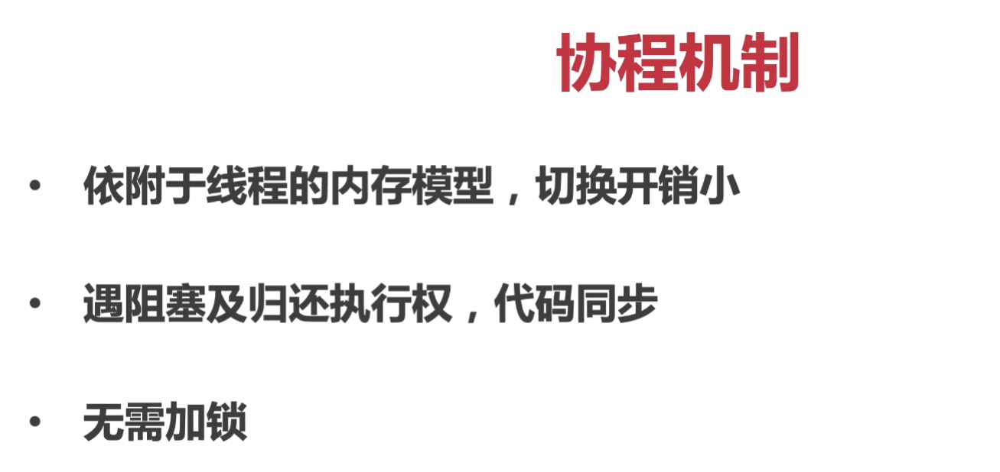

### 4.8 分布式会话


单机情况下：

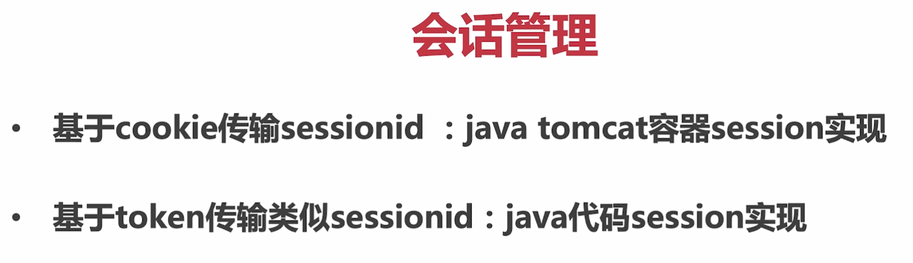

分布式的情况下，上面两种方式都会失效，因为：单体的会话管理，是基于tomcat的内存去实现的。

引入分布式情况下的会话管理：

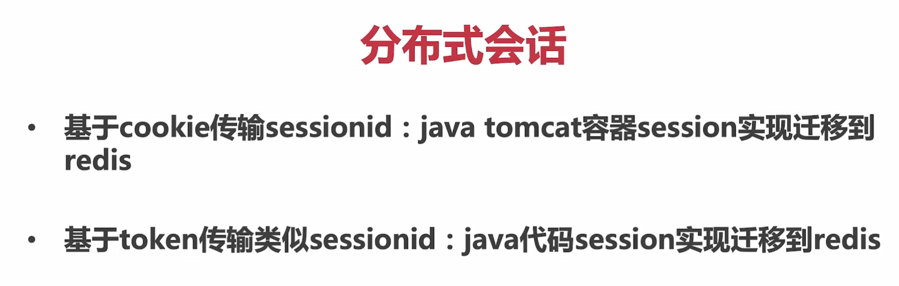

#### 4.8.1 基于cookie传输sessionid

##### 4.8.1.1 !安装配置redis

1. 引入redis的依赖

   只要引入了对应的jar包，spring boot默认的实现方式就会将session放入到对应的容器内

   ```xml
           <dependency>
               <groupId>org.springframework.boot</groupId>
               <artifactId>spring-boot-starter-data-redis</artifactId>
           </dependency>
   
   <!--        spring将自己对session的管理方式存储在redis中-->
           <dependency>
               <groupId>org.springframework.session</groupId>
               <artifactId>spring-session-data-redis</artifactId>
           </dependency>
   ```

   

2. 编写redis配置类

   ```java
   @Component
   @EnableRedisHttpSession(maxInactiveIntervalInSeconds = 3600)
   public class RedisConfig {
       
   }
   ```

   

3. 安装redis到服务器

   1. 到redis官网，复制下载链接

      这里我使用了之前做项目的时候的版本，6.06

      ```bash
      wget https://download.redis.io/releases/redis-5.0.4.tar.gz   换成老师的版本，以免后续出问题
      wget https://download.redis.io/releases/redis-6.0.6.tar.gz 	 第一次做项目时候用的版本
      ```

      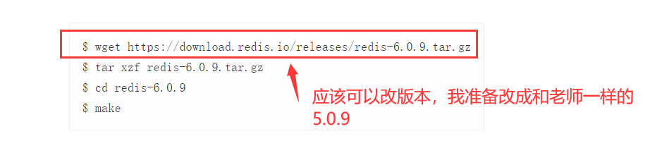

      

   2. 解压

      ```bash
      tar -xvzf redis-5.0.4.tar.gz
      ```

   3. 进入解压好的redis文件，编译

      ```bash
      make
      ```

      这里有可能提示没有安装gcc，可以采用4.4.4里面安装的方法

      ```bash
      yum install perl gcc kernel-devel
      yum upgrade kernel kernel-devel
      yum install pcre-devel openssl-devel gcc curl
      ```

      或者参考我之前的博客：https://blog.csdn.net/qq_32816723/article/details/108038541

      这里我采用的4.4.4节中的方法，然而make会出现错误，我又把博客里的内容输了一遍，解决

      ```bash
      yum -y install centos-release-scl
      yum -y install devtoolset-9-gcc devtoolset-9-gcc-c++ devtoolset-9-binutils
      echo "source /opt/rh/devtoolset-9/enable" >>/etc/profile
      重启服务器 执行make
      ```

   4. 安装

      ```bash
      make install
      ```

   5. 启动服务

      进入redis/src/目录，启动进程

      ```bash
      ./redis-server
      ```

      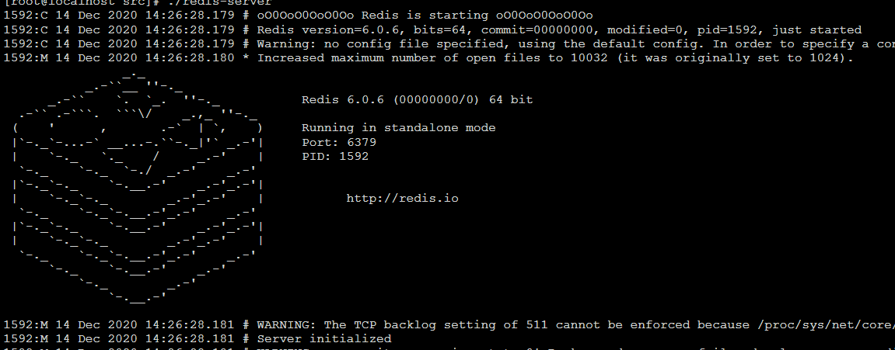

      出现这个界面，表示安装成功

   6. 实际开发中，应该用后台启动的方式

      ```bash
      ./redis-server &
      ```

   7. 操作

      在src/目录下，进入控制界面

      ```bash
      ./redis-cli
      ```

      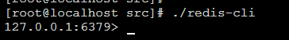

      

      当然我一般都是用redis-gui的那个app，在win10上操作

      

4. 修改redis的配置

   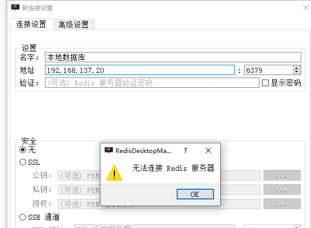

   这个时候可能访问不到服务器上的redis（即使关闭了防火墙），需要进行一些配置修改

   见BUG11

5. 测试

   在win10启动服务器。以登录为测试

   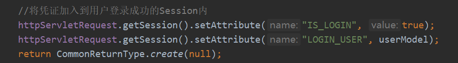

   登陆时会将UserModel的信息放入redis，因此UserModel类要实现序列化。（默认是JDK，后面会改成JSON序列化）

   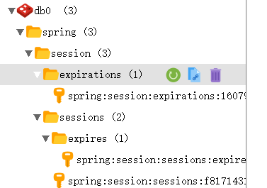

   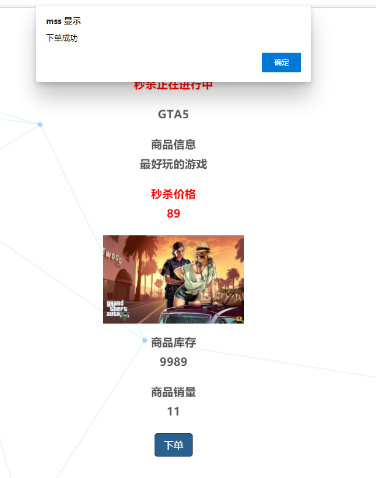

   测试成功！

#### 4.8.2 基于token传输

1. 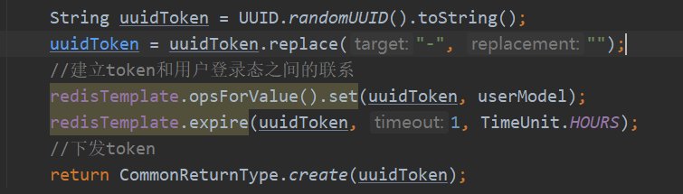
2. 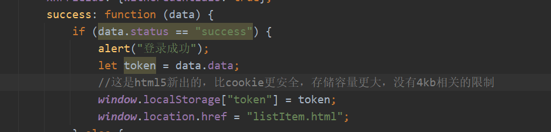
3. 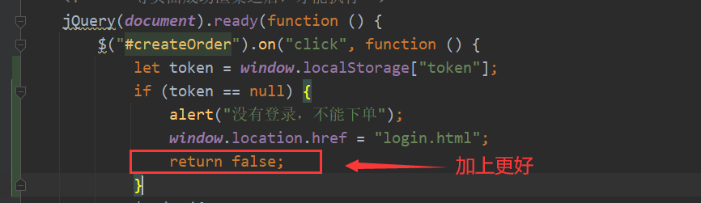
4. 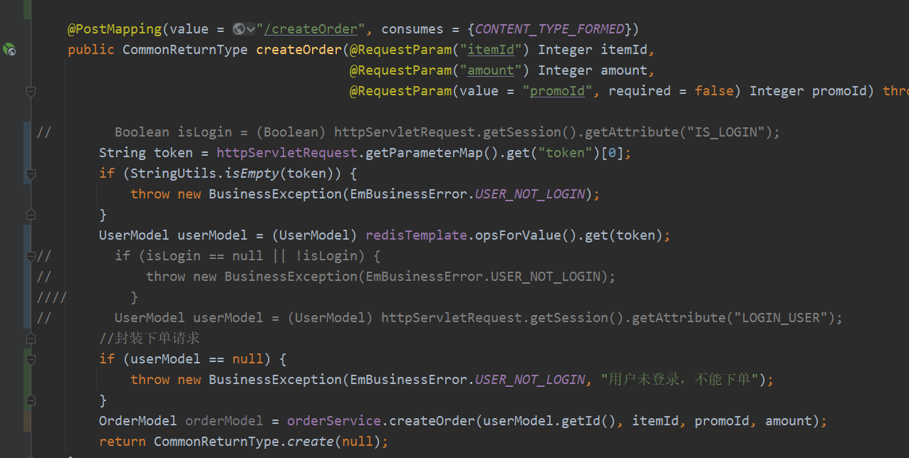

## 5 查询优化技术之多级缓存

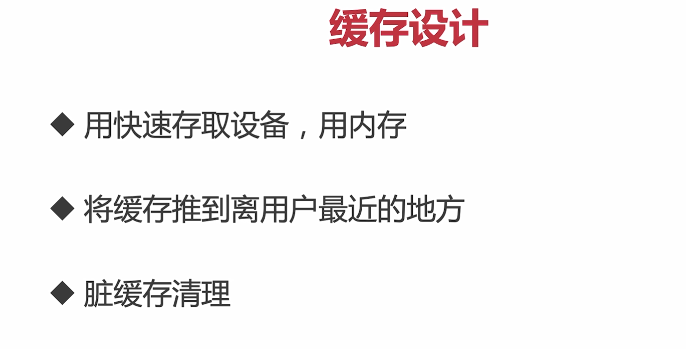

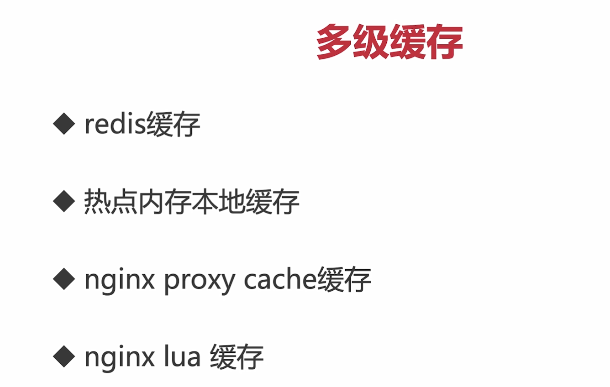

### 5.1 Redis

多级缓存的第一级

此时的架构：


几种redis模式：

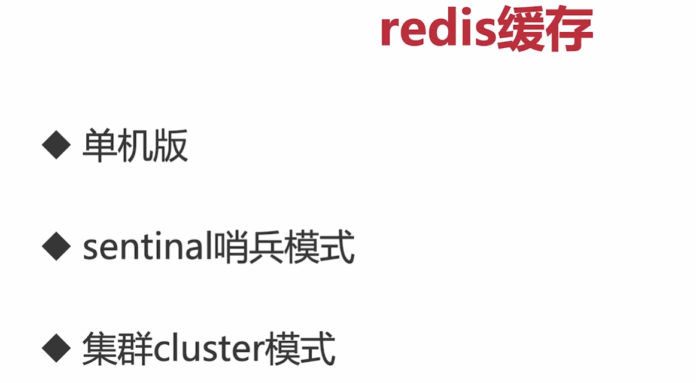

哨兵模式：

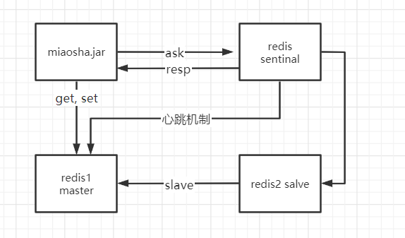

集群模式：

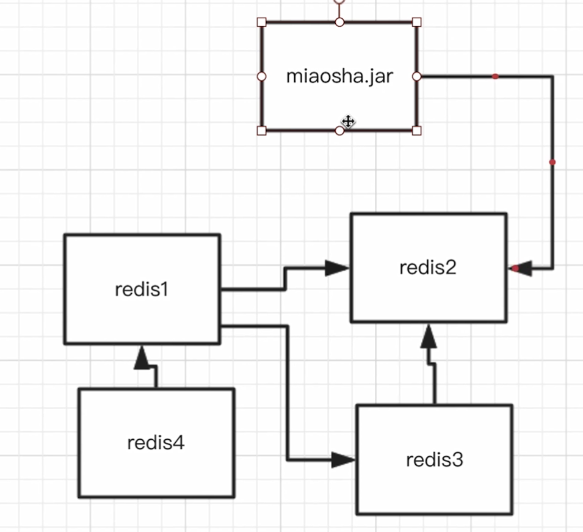

本项目中采用单机版，因为单机版的性能瓶颈和另外两个其实差不多，仅仅是水平扩展的容量问题

#### 5.1.1 商品详情动态内容实现

在ItemController添加这层逻辑，同时ItemModel和ItemModel内包含的PromoModel要实现序列化接口。

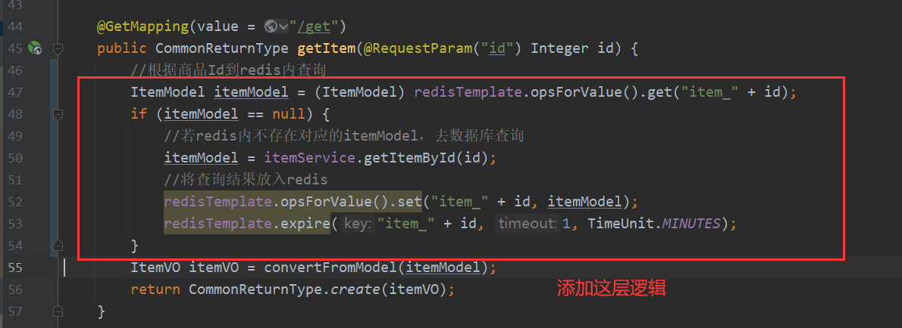

使用java默认的序列化时 ，看不到真正的key-value的值

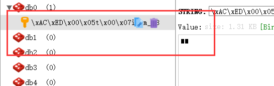

#### 5.1.2 JSON序列化

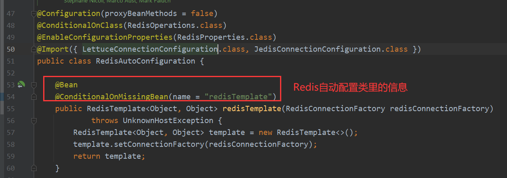

在自己的RedisConfig里面添加一个Bean

```java
    @Bean
    public RedisTemplate redisTemplate(RedisConnectionFactory redisConnectionFactory) throws UnknownHostException {
        RedisTemplate template = new RedisTemplate();
        template.setConnectionFactory(redisConnectionFactory);

        //解决key的序列化方式
        StringRedisSerializer stringRedisSerializer = new StringRedisSerializer();
        template.setKeySerializer(stringRedisSerializer);

        //解决value序列化方式，使用JSON
        Jackson2JsonRedisSerializer jackson2JsonRedisSerializer = new Jackson2JsonRedisSerializer(Object.class);
        template.setValueSerializer(jackson2JsonRedisSerializer);
        return template;
    }
```

此时redis内中的信息：key正常，但是value信息太繁琐：

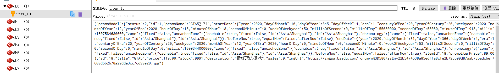


完整版比较复杂，直接给出代码：（这个可作为序列化的模板使用，特别是有日期信息时）

```java
public class JodaDateTimeJsonDeSerializer extends JsonDeserializer<DateTime> {
    @Override
    public DateTime deserialize(JsonParser p, DeserializationContext ctxt) throws IOException, JsonProcessingException {
        String dateString = p.readValueAs(String.class);
        DateTimeFormatter formatter = DateTimeFormat.forPattern("yyyy-MM-dd HH:mm:ss");
        return DateTime.parse(dateString, formatter);
    }
}
```

```java
public class JodaDateTimeJsonSerializer extends JsonSerializer<DateTime> {
    @Override
    public void serialize(DateTime value, JsonGenerator gen, SerializerProvider serializers) throws IOException {
        gen.writeString(value.toString("yyyy-MM-dd HH:mm:ss"));
    }
}
```

```java
@Component
@EnableRedisHttpSession(maxInactiveIntervalInSeconds = 3600)
public class RedisConfig {

    @Bean
    public RedisTemplate redisTemplate(RedisConnectionFactory redisConnectionFactory) throws UnknownHostException {
        RedisTemplate template = new RedisTemplate();
        template.setConnectionFactory(redisConnectionFactory);

        //解决key的序列化方式
        StringRedisSerializer stringRedisSerializer = new StringRedisSerializer();
        template.setKeySerializer(stringRedisSerializer);

        //解决value序列化方式，使用JSON
        Jackson2JsonRedisSerializer jackson2JsonRedisSerializer = new Jackson2JsonRedisSerializer(Object.class);
        ObjectMapper objectMapper = new ObjectMapper();
        SimpleModule simpleModule = new SimpleModule();
        simpleModule.addSerializer(DateTime.class, new JodaDateTimeJsonSerializer());
        simpleModule.addDeserializer(DateTime.class, new JodaDateTimeJsonDeSerializer());

        //给value里面的类，添加全限定名，便于反序列化
        objectMapper.activateDefaultTyping(LaissezFaireSubTypeValidator.instance,
                                           ObjectMapper.DefaultTyping.NON_FINAL,
                                           JsonTypeInfo.As.PROPERTY);

        objectMapper.registerModule(simpleModule);
        jackson2JsonRedisSerializer.setObjectMapper(objectMapper);
        template.setValueSerializer(jackson2JsonRedisSerializer);
        return template;
    }
}
```

#### 5.1.3 jmeter压测

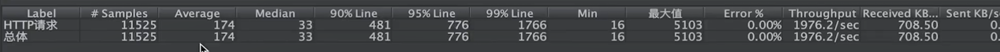

### 5.2 本地热点缓存

对redis的存或者取都需要经过网络的IO，达到redis所在的服务器。

本地热点缓存，多级缓存第二级。

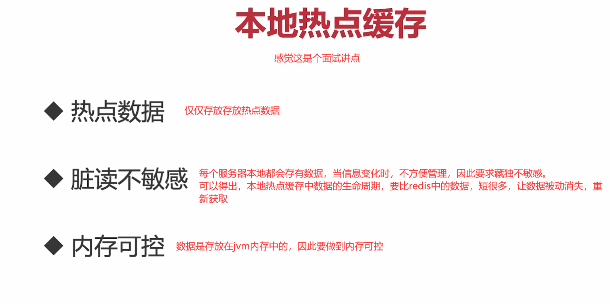

想法：使用一种类似于HashMap（key—value）的数据结构，并且需要支持并发读，并发写的能力（ConcurrentHashMap对段加锁，效率太低），支持失效时间功能（HashMap也不行），支持淘汰功能（内存容量上限时，淘汰）

幸好，有Guava cache

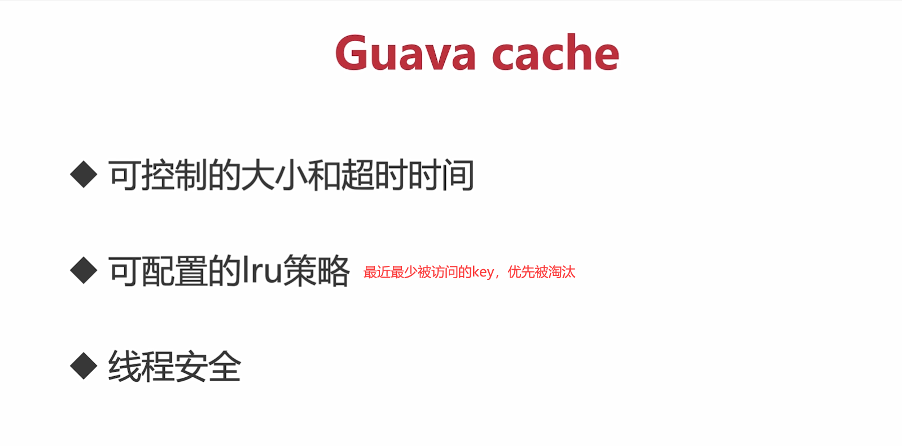

1. 引入jar包

   ```xml
           <dependency>
               <groupId>com.google.guava</groupId>
               <artifactId>guava</artifactId>
               <version>18.0</version>
           </dependency>
   ```

2. 编写代码

   ```java
   //封装本地缓存操作类
   public interface CacheService {
   
       //存方法
       void setCommonCache(String key, Object value);
   
       //取方法
       Object getFromCommonCache(String key);
   }
   ```

   ```java
   @Service
   public class CacheServiceImpl implements CacheService {
   
       private Cache<String, Object> commonCache;
   
       @PostConstruct
       public void init() {
           commonCache = CacheBuilder.newBuilder()
                   //设置缓存容器的初始容量为10
                   .initialCapacity(10)
                   //设置缓存中最大可以存储100个key，超过100个后，按照LRU的策略，移除缓存项
                   .maximumSize(100)
                   //写缓存后，多少时间过期
                   .expireAfterWrite(60, TimeUnit.SECONDS)
                   .build();
       }
   
       @Override
       public void setCommonCache(String key, Object value) {
           commonCache.put(key, value);
       }
   
       @Override
       public Object getFromCommonCache(String key) {
           return commonCache.getIfPresent(key);
       }
   }
   ```

   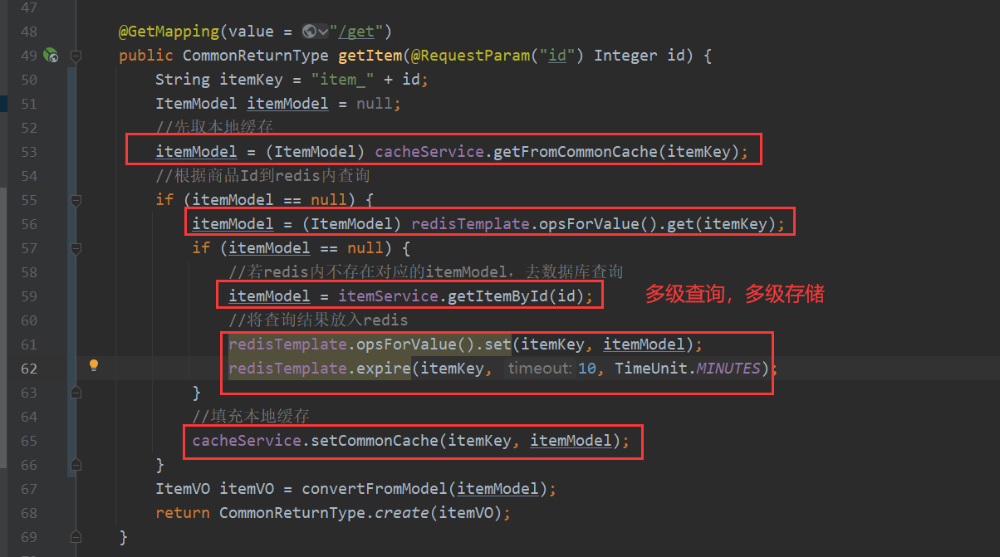

#### 5.2.1 jmeter压测

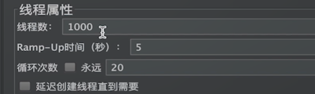

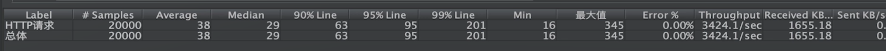

效果非常好

缺点：没有好的机制取更新数据，并且JVM容量有限

### 5.3 nginx proxy cache缓存 不使用，了解


修改nginx配置：


```bash
#cache
proxy_cache_path /usr/local/openresty/nginx/tmp_cache levels=1:2 keys_zone=tmp_cache:100m inactive=7d max_size=5g;

proxy_cache tmp_cache;
proxy_cache_key $uri;
proxy_cache_valid 200 206 304 302 7d;
```

在nginx目录下重启nginx

```bash
sbin/nginx -s reload
```

测试：发送一些get请求，发现tomcat日志中只有一个访问，并且nginx中生成了缓存信息


对应的一个缓存地址：`/usr/local/openresty/nginx/tmp_cache/8/f6`

缓存信息：


#### 5.3.1 jmeter性能压测


结果：TPS并没有提升什么，反而平均耗时更高了。

原因分析：此时的缓存，是将数据存放在磁盘当中的，并没有存放在nginx内存中，所以性能不行。因此不推荐使用这种方式。

### 5.4 nginx lua


#### 5.4.1 实例

1. 首先在opresty/路径下新建一个lua文件，里面用于存放脚本。

2. 编写一个脚本文件，staticitem.lua

   ```bash
   ngx.say("hello static item lua");
   ```

3. 修改nginx配置文件，在nginx路径下，使用 `vi conf/nginx.conf`，修改如下：

   

4. 测试，输入 mss/staticitem/get,此时会在网页上显示脚本中say()里面的内容

   

### 5.5 又见Openresty


#### 5.5.1 helloworld

这个例子类似于一个地址的转发

1. 编写一个`helloworld.lua`脚本，里面的内容：

   ```bash
   ngx.exec("/item/get?id=18");
   ```

2. 修改nginx配置文件：添加一个location，位置同上

   ```bash
   location /helloworld{
   content_by_lua_file ../lua/helloworld.lua;
   }
   ```

3. 测试，在浏览器中输入`http://mss/helloworld`，内容显示exec()中路径的返回结果

   

#### 5.5.2 shared dic 用内存来缓存

1. 在lua/路径下编写一个脚本，`temsharedic.lua`

   ```bash
   function get_from_cache(key)
           local cache_ngx = ngx.shared.my_cache
           local value = cache_ngx:get(key)
           return value
   end
   
   function set_to_cache(key,value,exptime)
           if not exptime then
                   exptime = 0
           end
           local cache_ngx = ngx.shared.my_cache
           local succ,err,forcible = cache_ngx:set(key,value,exptime)
           return succ
   end
   
   local args = ngx.req.get_uri_args()
   local id = args["id"]
   local item_model = get_from_cache("item_"..id)
   if item_model == nil then
           local resp = ngx.location.capture("/item/get?id="..id)
           item_model = resp.body
           set_to_cache("item"..id,item_model,1*60)
   end
   ngx.say(item_model)
   ```

2. 修改nginx配置：

   

   

3. 重启nginx

   ```bash
   [root@mss nginx]# sbin/nginx -s reload
   ```

##### 5.5.2.1 jmeter性能压测


比jvm缓存性能提升很小，对于nginx proxy cache提升很大。

#### 5.5.3 对redis的支持


进阶版：


此处采用了基础班的架构：

1. 编写lua脚本 `temredis.lua`

   ```bash
   local args = ngx.req.get_uri_args()
   local id = args["id"]
   local redis = require "resty.redis"
   local cache = redis:new()
   local ok,err = cache:connect("192.168.137.20",6379)
   local item_model = cache:get("item_"..id)
   if item_model == ngx.null or item_model == nil then
           local resp = ngx.location.capture("/item/get?id="..id)
           item_model = resp.body
   end
   
   ngx.say(item_model)
   ```

2. 修改nginx配置

   ```bash
   location /luaitem/get{
       default_type "application/json";
       content_by_lua_file ../lua/itemredis.lua;
   }
   ```

   

   

3. 重启nginx

   ```bash
   [root@mss nginx]# sbin/nginx -s reload
   ```

**这里有个BUG，发送luaitem甚至item/get请求时，redis中没有数据存放！！！见BUG12**

##### 5.5.3.1 jmeter性能压测


## 6 静态资源cdn


CDN需要阿里云，跳过

## 7 交易性能优化

### 7.1 原始代码性能压测

#### 7.1.1 第一次压测

压测请求路径：


结果：


#### 7.1.2 第二次压测


结果：


#### 7.1.3 交易性能瓶颈


原因：


### 7.2 交易验证优化


在交易下单的时候，需要根据商品id取出对应的ItemModel验证一下，这个环节引入了redis

1. 

2. 实现：

   

3. 下单环节中的使用：（OrderServiceImpl.java）

   


jmeter性能压测：


结果：


性能提升很明显

### 7.3 库存行锁优化


之前的项目中并没有给item_stock表中的item_id添加索引，这里需要补上

```sql
ALTER table item_stock ADD UNIQUE INDEX
item_id_index(item_id)
```

优化方案：


优化：

1. 

2. 

3. 

   单纯的这样操作，会有数据库与redis中数据不一致的问题，需要引入异步消息机制


#### 7.3.1 异步同步数据库


#### 7.3.2 安装rocketMQ

安装在数据库服务器上面

```bash
https://mirrors.bfsu.edu.cn/apache/rocketmq/4.7.1/rocketmq-all-4.7.1-bin-release.zip
https://archive.apache.org/dist/rocketmq/4.4.0/rocketmq-all-4.4.0-bin-release.zip 4.4.0  采用老师的版本
yum install unzip	//安装解压功能
unzip rocketmq-all-4.7.1-bin-release.zip
nohup sh bin/mqnamesrv &

```

运行到此需要修改配置：`[root@localhost bin]# vi mqbroker.xml`


修改之后：

```bash
</-Xmx1g>
<-XX:NewSize>128M</-XX:NewSize>
<-XX:MaxNewSize>128M</-XX:MaxNewSize>
<-XX:PermSize>64M</-XX:PermSize>
<-XX:MaxPermSize>64M</-XX:MaxPermSize>
```

还需要修改: `[root@localhost bin]# vi runbroker.sh `


改成：


启动：`nohup sh bin/mqbroker -n localhost:9876 &`

测试：

```bash
export NAMESRV_ADDR=localhost:9876
sh bin/tools.sh org.apache.rocketmq.example.quickstart.Producer
sh bin/tools.sh org.apache.rocketmq.example.quickstart.Consumer
```

#### 7.3.3 编辑自己的topic

```bash
[root@localhost bin]# ./mqadmin updateTopic -n localhost:9876 -t stock -c DefaultCluster
```

这里报错了，见**BUG13**

解决之后，创建成功：

```bash
[root@localhost bin]# ./mqadmin updateTopic -n localhost:9876 -t stock -c DefaultCluster
Java HotSpot(TM) 64-Bit Server VM warning: ignoring option PermSize=128m; support was removed in 8.0
Java HotSpot(TM) 64-Bit Server VM warning: ignoring option MaxPermSize=128m; support was removed in 8.0
create topic to 192.168.137.20:10911 success.
TopicConfig [topicName=stock, readQueueNums=8, writeQueueNums=8, perm=RW-, topicFilterType=SINGLE_TAG, topicSysFlag=0, order=false][root@localhost bin]# 
```

#### 7.3.4 实现代码

1. 导包

   ```xml
    <dependency>
           <groupId>org.apache.rocketmq</groupId>
           <artifactId>rocketmq-client</artifactId>
           <version>4.3.0</version>
       </dependency>
   ```

2. 添加properties配置，便于注入属性

   ```properties
   mq.nameserver.addr=192.168.137.20:9876
   mq.topicname=stock
   ```

3. 编写Producer类

   ```java
   @Component
   public class MqProducer {
   
       private DefaultMQProducer producer;
   
       @Value("${mq.nameserver.addr}")
       private String nameAddr;
   
       @Value("${mq.topicname}")
       private String topicName;
   
       @PostConstruct
       public void init() throws MQClientException {
           //mq producer 的初始化
           producer = new DefaultMQProducer("producer_group");
           producer.setNamesrvAddr(nameAddr);
           producer.start();
       }
   
       //同步库存扣减消息
       public boolean asyncReduceStock(Integer itemId, Integer amount) {
           Map<String, Object> bodyMap = new HashMap<>();
           bodyMap.put("itemId", itemId);
           bodyMap.put("amount", amount);
           Message message = new Message(topicName, "increase", JSON.toJSON(bodyMap).toString().getBytes(StandardCharsets.UTF_8));
           try {
               producer.send(message);
           } catch (MQClientException e) {
               e.printStackTrace();
               return false;
           } catch (RemotingException e) {
               e.printStackTrace();
               return false;
           } catch (MQBrokerException e) {
               e.printStackTrace();
               return false;
           } catch (InterruptedException e) {
               e.printStackTrace();
               return false;
           }
           return true;
       }
   }
   ```

4. 编写Consumer类

   ```java
   @Component
   public class MqConsumer {
   
       private DefaultMQPushConsumer consumer;
   
       @Value("${mq.nameserver.addr}")
       private String nameAddr;
   
       @Value("${mq.topicname}")
       private String topicName;
   
       @Resource
       private ItemStockDOMapper itemStockDOMapper;
   
       @PostConstruct
       public void init() throws MQClientException {
           consumer = new DefaultMQPushConsumer("stock_consumer_group");
           consumer.setNamesrvAddr(nameAddr);
           consumer.subscribe(topicName, "*");
           consumer.registerMessageListener(new MessageListenerConcurrently() {
               @Override
               public ConsumeConcurrentlyStatus consumeMessage(List<MessageExt> list, ConsumeConcurrentlyContext consumeConcurrentlyContext) {
                   MessageExt messageExt = list.get(0);
                   String jsonStr = new String(messageExt.getBody());
                   Map<String, Object> map = JSON.parseObject(jsonStr, Map.class);
                   Integer itemId = (Integer) map.get("itemId");
                   Integer amount = (Integer) map.get("amount");
                   //实现数据库内扣减
                   itemStockDOMapper.decreaseStock(itemId, amount);
                   return ConsumeConcurrentlyStatus.CONSUME_SUCCESS;
               }
           });
           consumer.start();
       }
   }
   ```

5. 在减库存逻辑中添加异步扣减数据库的步骤

   

6. 存在的问题：

   

## 8 交易优化技术之事务型消息

### 8.1 让异步扣减独立依赖于外部事务


引入这段逻辑：

```java
TransactionSynchronizationManager.registerSynchronization(new TransactionSynchronizationAdapter() {
            @Override
            public void afterCommit() {
                //异步扣减库存
                boolean mqResult = itemService.asyncDecreaseStock(itemId, amount);
//                if (!mqResult) {
//                    itemService.increaseStock(itemId, amount);
//                    throw new BusinessException(EmBusinessError.MQ_SEND_FAIL);
//                }
            }
        });
```

意思是，只有外部距离最近的事务成功提交之后，这段逻辑才会执行。此时外部的最近事务就是外部方法：


也就是说，只有订单生成，redis中库存扣减成功之后，才回执行异步扣减数据库的操作。

**重要缺点，如果异步消息发送失败，则数据库中库存状态就变异常了**

### 8.2 事务型消息，流水  ! 难点，重点分析，面试讲解

为了解决8.1中的问题，采用了rocketmq中的事务消息

1. 

2. 编写事务型消息：

   ```java
    public boolean transactionAsyncReduceStock(Integer userId, Integer itemId, Integer promoId, Integer amount, String stockLogId) {
           Map<String, Object> bodyMap = new HashMap<>();
           bodyMap.put("itemId", itemId);
           bodyMap.put("amount", amount);
           bodyMap.put("stockLogId", stockLogId);
   
           Map<String, Object> argsMap = new HashMap<>();
           argsMap.put("itemId", itemId);
           argsMap.put("amount", amount);
           argsMap.put("userId", userId);
           argsMap.put("promoId", promoId);
           argsMap.put("stockLogId", stockLogId);
           Message message = new Message(topicName, "increase", JSON.toJSON(bodyMap).toString().getBytes(StandardCharsets.UTF_8));
           TransactionSendResult transactionSendResult = null;
           try {
               transactionSendResult = transactionMQProducer.sendMessageInTransaction(message, argsMap);
           } catch (MQClientException e) {
               e.printStackTrace();
               return false;
           }
           if (transactionSendResult.getLocalTransactionState() == LocalTransactionState.ROLLBACK_MESSAGE) {
               return false;
           } else if (transactionSendResult.getLocalTransactionState() == LocalTransactionState.COMMIT_MESSAGE) {
               return true;
           } else {
               return false;
           }
       }
   ```

3. 在init函数中初始化事务型producer

   ```java
   transactionMQProducer.setTransactionListener(new TransactionListener() {
               @Override
               public LocalTransactionState executeLocalTransaction(Message msg, Object arg) {
                   //真正要做的事，创建订单
                   Integer userId = (Integer) ((Map) arg).get("userId");
                   Integer itemId = (Integer) ((Map) arg).get("itemId");
                   Integer promoId = (Integer) ((Map) arg).get("promoId");
                   Integer amount = (Integer) ((Map) arg).get("amount");
                   String stockLogId = (String) ((Map) arg).get("stockLogId");
                   try {
                       orderService.createOrder(userId, itemId, promoId, amount, stockLogId);
                   } catch (BusinessException e) {
                       e.printStackTrace();
                       //设置stockLog为回滚状态
                       StockLogDO stockLogDO = stockLogDOMapper.selectByPrimaryKey(stockLogId);
                       stockLogDO.setStatus(3);
                       stockLogDOMapper.updateByPrimaryKeySelective(stockLogDO);
                       return LocalTransactionState.ROLLBACK_MESSAGE;
                   }
                   return LocalTransactionState.COMMIT_MESSAGE;
               }
   
               @Override
               public LocalTransactionState checkLocalTransaction(MessageExt msg) {
                   //根据是否扣减库存成功来判断，要返回commit还是rollback，抑或unkown
                   String jsonStr = new String(msg.getBody());
                   Map<String, Object> map = JSON.parseObject(jsonStr, Map.class);
                   Integer itemId = (Integer) map.get("itemId");
                   Integer amount = (Integer) map.get("amount");
                   String stockLogId = (String) map.get("stockLogId");
                   StockLogDO stockLogDO = stockLogDOMapper.selectByPrimaryKey(stockLogId);
                   if (stockLogDO == null) {
                       return LocalTransactionState.UNKNOW;
                   }
                   if (stockLogDO.getStatus().intValue() == 2) {
                       return LocalTransactionState.COMMIT_MESSAGE;
                   } else if (stockLogDO.getStatus().intValue() == 1) {
                       return LocalTransactionState.UNKNOW;
                   }
                   return LocalTransactionState.ROLLBACK_MESSAGE;
               }
           });
   ```

4. 设计一个新的表，stock_log，便于事务查看状态

   

   在OrderController中修改逻辑：

   

   注意这里添加了售罄的标识

   

   

5. 更新流水状态

   

   

6. 

## 9 流量削峰技术


### 9.1 秒杀令牌

为了防止有人知道秒杀活动下单接口，利用脚步不断刷，可以引入秒杀令牌。

1. 

2. 实现接口，同时加入了校验功能，因此下单模块可以不做一些校验

   ```java
    	@Override
       public String generateSecondKillToken(Integer promoId, Integer itemId, Integer userId) {
           ItemModel itemModel = itemService.getItemByIdInCache(itemId);
           if (itemModel == null) {
               return null;
           }
           UserModel userModel = userService.getUserByIdInCache(userId);
           if (userModel == null) {
               return null;
           }
           //获取商品对应的秒杀信息
           PromoDO promoDO = promoDOMapper.selectByPrimaryKey(promoId);
           PromoModel promoModel = convertFromDataObject(promoDO);
           if (promoModel == null) {
               return null;
           }
           if (promoModel.getStartDate().isAfterNow()) {
               promoModel.setStatus(1);
           } else if (promoModel.getEndDate().isBeforeNow()) {
               promoModel.setStatus(3);
           } else {
               promoModel.setStatus(2);
           }
           if (promoModel.getStatus().intValue() != 2) {
               //不是正在进行中的活动
               return null;
           }
           String token = UUID.randomUUID().toString().replace("-", "");
           redisTemplate.opsForValue().set("promo_token_" + promoId + "_userId_" + userId + "_itemId_" + itemId, token);
           redisTemplate.expire("promo_token_" + promoId + "_userId_" + userId + "_itemId_" + itemId, 5, TimeUnit.MINUTES);
           return token;
       }
   ```

3. 添加路径请求

   ```java
       @PostMapping(value = "/generateToken", consumes = {CONTENT_TYPE_FORMED})
       public CommonReturnType generateToken(@RequestParam("itemId") Integer itemId,
                                             @RequestParam(value = "promoId") Integer promoId) throws BusinessException {
           //获取用户信息
           String token = httpServletRequest.getParameterMap().get("token")[0];
           if (StringUtils.isEmpty(token)) {
               throw new BusinessException(EmBusinessError.USER_NOT_LOGIN);
           }
           UserModel userModel = (UserModel) redisTemplate.opsForValue().get(token);
           if (userModel == null) {
               throw new BusinessException(EmBusinessError.USER_NOT_LOGIN, "用户未登录，不能下单");
           }
   
           //获取秒杀令牌
           String secondKillToken = promoService.generateSecondKillToken(promoId, itemId, userModel.getId());
           if (secondKillToken == null) {
               throw new BusinessException(EmBusinessError.PARAMETER_VALIDATION_ERROR, "生成令牌失败");
           }
           return CommonReturnType.create(secondKillToken);
       }
   ```

4. 改动下单请求
   

5. 改写前端页面

   

   

   缺点：

   

### 9.2 秒杀大闸


1. 在promo发布逻辑中，设定一个大闸限制数值

   

2. 将售罄检测移动到生成令牌的逻辑中

   

   同时读取大闸数量，并检测

   

缺点：


### 9.3 队列泄洪 ！多线程重点


1. 引入线程池

   

2. 开启线程

   


## 10 防刷限流技术


### 10.1 验证码技术


1. 引入代码生成器的代码文件

   

   

2. OrderController中编写一个生成验证码的逻辑

   ```java
       @RequestMapping(value = "/generateVerifyCode", method = {RequestMethod.POST, RequestMethod.GET})
       public void generateVerifyCode(HttpServletResponse response) throws BusinessException, IOException {
           String token = httpServletRequest.getParameterMap().get("token")[0];
           if (StringUtils.isEmpty(token)) {
               throw new BusinessException(EmBusinessError.USER_NOT_LOGIN, "用户还没登录，不能生成验证码");
           }
           UserModel userModel = (UserModel) redisTemplate.opsForValue().get(token);
           if (userModel == null) {
               throw new BusinessException(EmBusinessError.USER_NOT_LOGIN, "用户未登录，不能生成验证码");
           }
           Map<String,Object> map = CodeUtil.generateCodeAndPic();
           redisTemplate.opsForValue().set("verify_code_" + userModel.getId(), map.get("code"));
           redisTemplate.expire("verify_code_" + userModel.getId(), 5, TimeUnit.MINUTES);
           ImageIO.write((RenderedImage) map.get("codePic"), "jpeg", response.getOutputStream());
           System.out.println("验证码的值为："+map.get("code"));
       }
   ```

3. 更改前端的下单逻辑

   

   此时的下单按钮，会生成验证码，用户点击验证，才走的是之前下单的那些流程

   

### 10.2 限流技术


1. 引入谷歌的guava限流工具

   

2. 在下单的controller中添加

   

### 10.3 防黄牛


## 11 课程总结


## 附录 遇到的 BUG*

### 1 jQuery突然失效

我佛了，前端页面的jQuery突然失效了，我下午刚来的时候还是正常的····重新建个分支，回退一下看看


我佛了，把本地的前端分支给删掉了，并且应该是选择了delete tracked，把github上面的分支也给删掉了，幸好我台式机里新建了一个分支，笔记本里面应该还有保存，晚上回去再试试，现在还是专注于后端编写吧，加快速度把项目重新过一遍，前端页面也玩了玩。

emmm我把自己的前端页面和对应的资源文件放在另一个路径下，问题就没有了···神奇


2020/12/10，今天又不能识别到了，不过不影响使用~~~

### 2 页面跳转问题

在2.2.1中我也讲了前端页面添加return false的情况，让我印象更为深刻的是这里：


如上图我的登录页面，我的设计目的是输入信息之后点击登录，可以进入到首页；点击注册到时候，可以进入注册界面，然而最开始点击注册的时候，进入了一个错误页面：


解决方法：添加return false：


这应该是form表单的问题，老师在课程中也提到了

奇怪的是课程提供的前端页面，没有设置也能够跳转成功。。。

另外一种解决方法是把submit属性改成button，就不用添加return false了。参考资料2


参考资料：

1. https://blog.csdn.net/yjz_sdau/article/details/82315591?utm_medium=distribute.pc_relevant_t0.none-task-blog-OPENSEARCH-1.control&depth_1-utm_source=distribute.pc_relevant_t0.none-task-blog-OPENSEARCH-1.control
2. https://www.cnblogs.com/leongirl/p/6690507.html

### 3 创建商品，没有反应


原因：


但是有出现了一个新的问题，提交之后，能够进入到数据库，说明提交成功，但是页面没有alert弹窗出现，交互特别差。

当我把


改为


后就有弹窗了，只不过弹出的是错误信息，但是数据库中还添加了商品，真是佛了


DEBUG了一下：


**哈哈，原因找到了，原来是我的ItemVO类，只给出了属性，并没有给出get和set方法(重点应该是set)，加上方法之后，就一切正常了。**

我又重新测试了一下，前端页面换成后也能成功创建商品并弹出alerti信息。我建议还是采用这种方式，因为有异常时，data是定义的map，map可以调用get方法来获取其中的异常信息。


### 4 无法建立promo表

建立promo表时出现下图错误：


按照这种方式，并不能解决：https://www.cnblogs.com/xmnote/p/11651491.html 重启mysql服务后也不能解决。。

于是从之前的数据库中复制了这张表···醉了

经过我的测试，发现datetime列，需要手动加上长度和小数点的数值，0


### 5 查询不到秒杀信息

写好Promo类和前端页面后，发现前端没有展示出秒杀的信息，调用查询接口发现，并没有获取到秒杀的信息。

DEBUG找找原因。

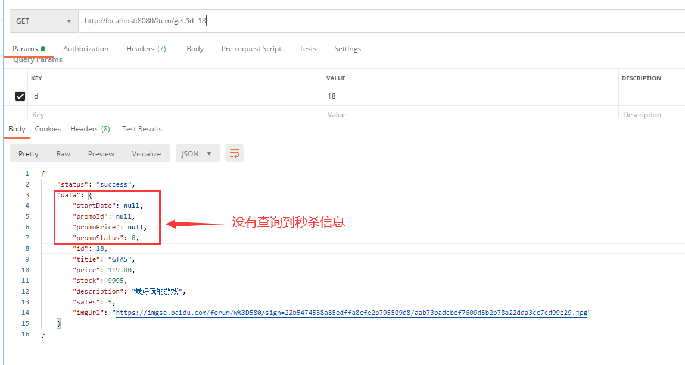

原因，ItemServiceImpl里面将promoModel注入到ItemModel里面的步骤，放到createItem方法里面了。

并且怎么PromoDO里面的日期字段时startTime和endTime？我数据库里面的列明明是date结尾，并且自动生成配置里面连接的数据库也没有错。当我把seckill数据库里面的promo表的日期从time改成date结尾后，就正常了。。不应该啊

### 6 nginx设置之后，登录信息异常

这部分的原因和解决方案见**4.8 分布式会话**

在4.4.7设置号nginx后，能够访问资源并且发出请求，但是登录成功之后，却显示出下单失败的信息，原因为用户未登录。。

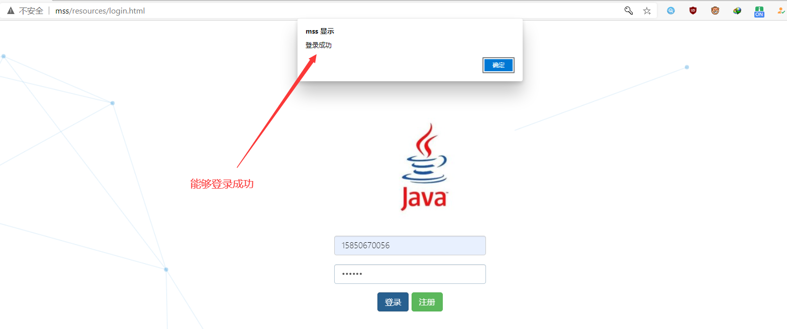

进入商品详情页面，下单却报错

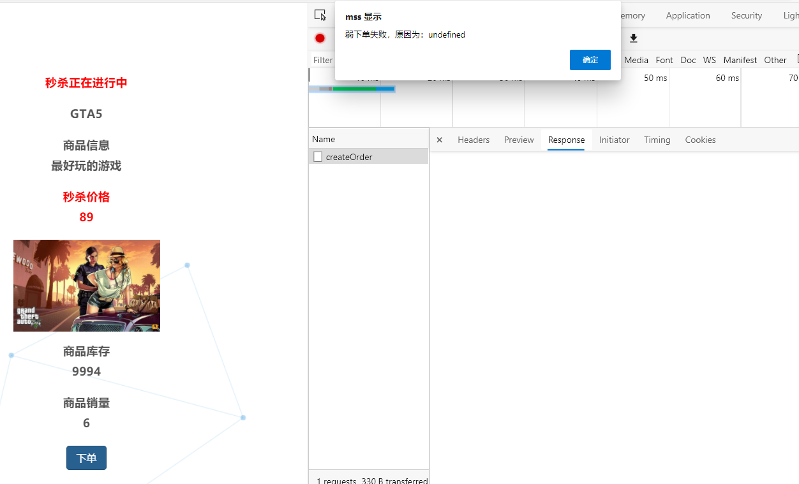

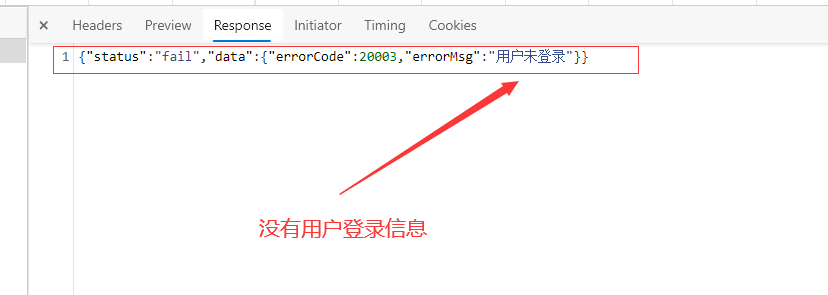

目前我还不知道解决方法，看后面老师的课程有没有发现吧。。。

2020/12/13，我想原因应该是这个：没有SESSION的信息


老师的是这样：

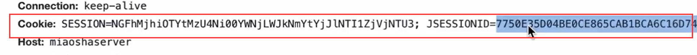

原因：

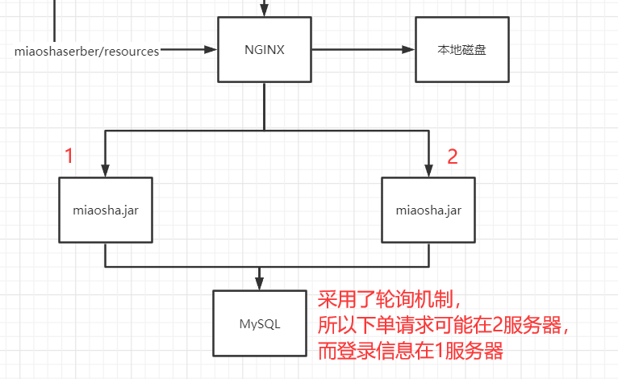

但是这里引出了问题8.

### 8 单机会话管理，未登录不跳转到登录页面

弄清了问题8之后，又发现了这个问题

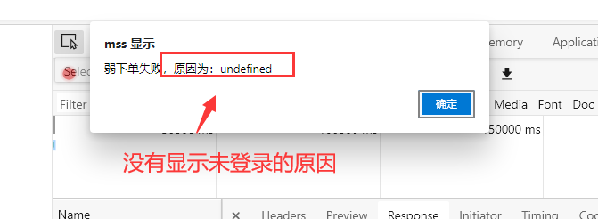

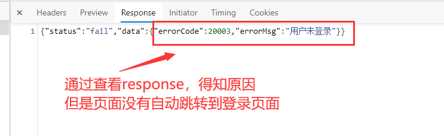


### 9 nginx于两台服务器查询连接数为0

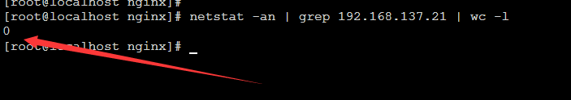

如图所示，但老师课程上是有连接数的，特别是设置了长连接之后。4.4.6节

并且jmeter压测也显示错误http请求

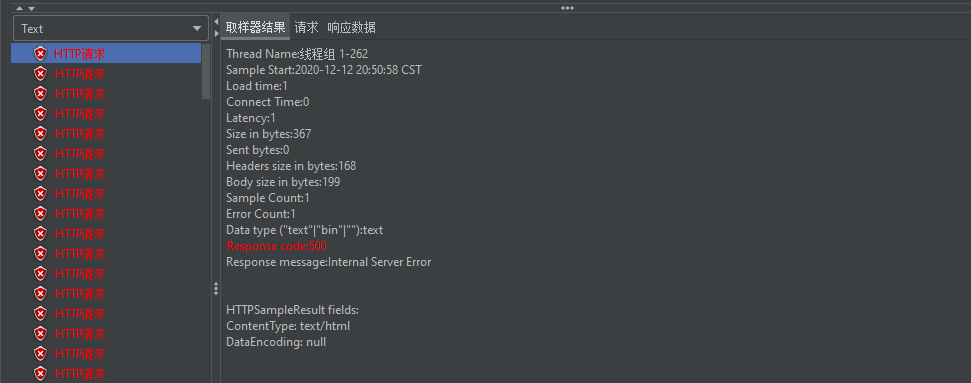

但是在网页上输入`mss/item/get?id=18`是有数据返回的呀

发现老师的配置更改了：

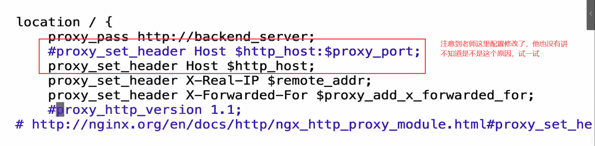

结论：不是这个原因。神奇

### 10 本地服务器连不上外网

有时候本地服务器连不上外网，具体表现为yum命令无效，ping www.baidu.com 不行，此时应该将共享网卡的设置重新操作一下，或者将https://www.cnblogs.com/kasnti/p/11727755.html#1317616020的流程重新走一遍（UseDNS no 不是这个问题）。

这个问题的解决很关键！

### 11 win10主机连不上linux上的redis

这个问题我之前没遇到过···

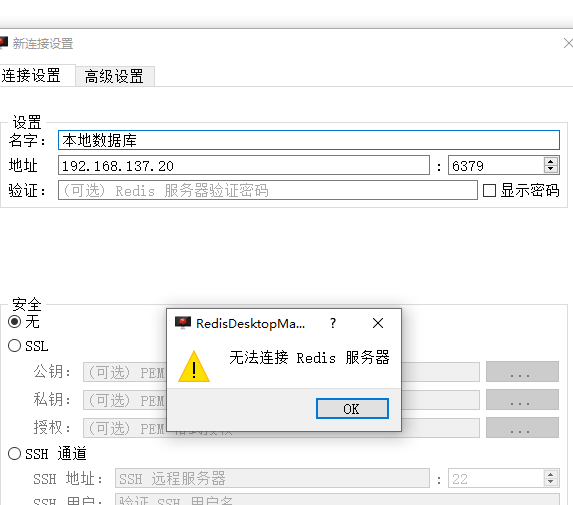

我修改了redis.conf配置也不行，佛了，再找找其它的解决方案吧

解决方法1：

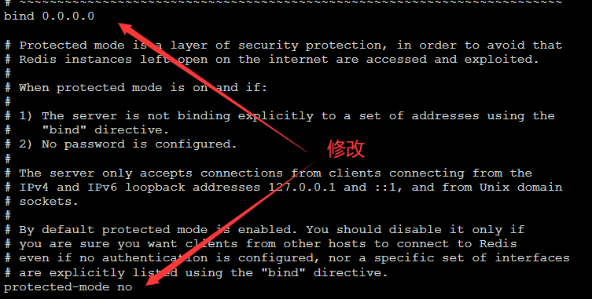

修改redis/路径下的redis.config，然后进入redis/src路径，以这样的命令启动redis，redismanager能够连接上redis了

但是这样并不是后台运行，有点麻烦，以后台运行./redis-server & ，manager又连接不上redis了

```bash
./redis-server /tmp/redis-6.0.6/redis.conf
```

····可以采用这样的方式运行

```bash
./redis-server /tmp/redis-6.0.6/redis.conf &   也是后台启动
```

就算`./redis-server /tmp/redis-6.0.6/redis.conf`启动，把终端关了重新打开一个就行

不过我很好奇，redis配置修改后，它不能识别吗，还要通过命令的方式加载配置文件

其实是我太超前了，老师在下一个视频就讲了修改配置文件

------

即使manager能够连接上redis，java启动也会报错

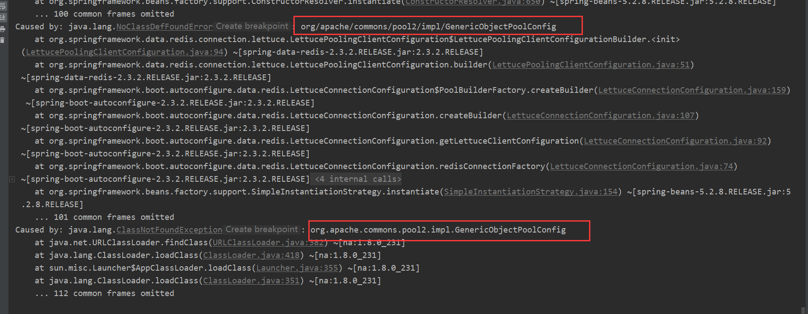

真烦~~~我看还是docker好用

解决办法：换成jedis数据源

### 12 nginx开启redis缓存后redis中无数据

**5.5.3 发送luaitem甚至item/get请求时，redis中没有数据存放！！！**暂时不想管了，后面有机会再想想原因

但是压测的时候，redis和老师一样，压力是最大的啊，说明请求了redis，但是没有数据存在，绝了


### 13 创建rocketmq的topic报错

7.3.3节创建topic时报错：


解决方案：

我卸载了jdk8271，安装了jdk8261，因为之前做的时候用的261版本，不过我估计跟版本没有关系。

然后修改rocketmq/bin/目录下的tools.sh配置，修改如下：

```bash
JAVA_OPT="${JAVA_OPT} -Djava.ext.dirs=${BASE_DIR}/lib:${JAVA_HOME}/jre/lib/ext:/usr/java/jdk1.8.0_261-amd64/jre/lib/ext"
```

参考：

https://blog.csdn.net/weixin_43952417/article/details/105715660

https://blog.csdn.net/l18637220680/article/details/95379498